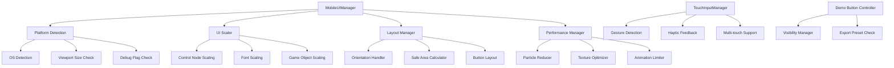

# Design Document: Mobile Responsive UI

## Overview

This design implements mobile-responsive UI scaling and optimization for the Waterwise Godot game. The system addresses the core challenge of making a desktop-designed game playable on mobile devices by implementing adaptive UI scaling, touch-optimized controls, performance optimizations, and platform-specific adjustments.

The design introduces a centralized `MobileUIManager` autoload that detects the platform, applies appropriate scaling transformations, manages touch input through the existing `TouchInputManager`, and provides configuration options for testing and customization. The system integrates seamlessly with Godot's existing UI system while maintaining backward compatibility with desktop gameplay.

### Key Design Goals

1. **Automatic Platform Detection**: Detect mobile platforms (Android/iOS) and small viewports (<800px width) to automatically apply mobile optimizations
2. **Consistent Scaling**: Apply uniform scaling rules across all UI elements (1.5x for controls, 1.4x for game objects, 1.3x for collectibles)
3. **Touch Optimization**: Ensure all interactive elements meet minimum touch target sizes (80x80px minimum, 100x60px for buttons)
4. **Performance**: Maintain 30 FPS on mobile through particle reduction, texture compression, and animation limiting
5. **Safe Area Handling**: Respect device notches and rounded corners by maintaining proper margins
6. **Developer Experience**: Provide debug mode for desktop testing and configuration files for easy customization

## Architecture

### Component Overview



### System Integration

The mobile responsive system integrates with existing Godot autoloads:

- **TouchInputManager**: Already exists, handles touch input and gestures
- **GameManager**: Existing, manages game state and minigame flow
- **MobileUIManager** (new): Central coordinator for mobile-specific UI adaptations
- **Scene Scripts**: Modified to query MobileUIManager for scaling factors

### Data Flow

1. **Initialization**: MobileUIManager detects platform on `_ready()`
2. **Scene Load**: Each scene queries MobileUIManager for mobile status and scaling factors
3. **UI Creation**: UI elements apply scaling during instantiation
4. **Runtime**: TouchInputManager processes input, MobileUIManager monitors performance
5. **Orientation Change**: MobileUIManager triggers layout reorganization

## Components and Interfaces

### MobileUIManager (Autoload)

Central manager for all mobile-specific UI adaptations.

```gdscript
extends Node

## Signals
signal mobile_mode_changed(is_mobile: bool)
signal orientation_changed(is_portrait: bool)
signal safe_area_changed(margins: Dictionary)

## Configuration
@export var mobile_ui_scale: float = 1.5
@export var mobile_font_scale: float = 1.4
@export var mobile_game_object_scale: float = 1.4
@export var mobile_collectible_scale: float = 1.3
@export var mobile_button_min_size: Vector2 = Vector2(100, 60)
@export var mobile_touch_target_min_size: Vector2 = Vector2(80, 80)
@export var mobile_button_spacing_vertical: float = 20.0
@export var mobile_button_spacing_horizontal: float = 15.0
@export var mobile_safe_area_margin: float = 20.0
@export var mobile_edge_dead_zone: float = 15.0

## State
var is_mobile: bool = false
var is_portrait: bool = false
var safe_area_margins: Dictionary = {}
var debug_mobile_mode: bool = false

## Public Interface
func is_mobile_platform() -> bool
func get_ui_scale() -> float
func get_font_scale() -> float
func get_game_object_scale() -> float
func get_collectible_scale() -> float
func get_button_min_size() -> Vector2
func get_touch_target_min_size() -> Vector2
func get_safe_area_margins() -> Dictionary
func apply_mobile_scaling(node: Control) -> void
func apply_game_object_scaling(node: Node2D) -> void
func should_show_demo_buttons() -> bool
func enable_debug_mobile_mode(enabled: bool) -> void
func load_config_file(path: String) -> void
```

### UI Scaler Component

Handles scaling transformations for UI elements.

```gdscript
class_name UIScaler

static func scale_control_node(node: Control, scale_factor: float) -> void:
    # Scale while maintaining aspect ratio
    node.scale = Vector2(scale_factor, scale_factor)
    
static func scale_font(label: Label, scale_factor: float) -> void:
    # Scale font size
    var current_size = label.get_theme_font_size("font_size")
    label.add_theme_font_size_override("font_size", int(current_size * scale_factor))
    
static func ensure_minimum_size(node: Control, min_size: Vector2) -> void:
    # Ensure node meets minimum size requirements
    if node.size.x < min_size.x or node.size.y < min_size.y:
        node.custom_minimum_size = min_size
```

### Layout Manager Component

Manages responsive layouts and orientation changes.

```gdscript
class_name LayoutManager

static func reorganize_for_orientation(container: Container, is_portrait: bool) -> void:
    # Switch between vertical and horizontal/grid layouts
    if is_portrait:
        _apply_vertical_layout(container)
    else:
        _apply_horizontal_layout(container)
        
static func apply_safe_area_margins(node: Control, margins: Dictionary) -> void:
    # Apply safe area margins to prevent overlap with notches
    if node is MarginContainer:
        node.add_theme_constant_override("margin_top", margins.get("top", 0))
        node.add_theme_constant_override("margin_bottom", margins.get("bottom", 0))
        node.add_theme_constant_override("margin_left", margins.get("left", 0))
        node.add_theme_constant_override("margin_right", margins.get("right", 0))
```

### Performance Manager Component

Optimizes performance for mobile devices.

```gdscript
class_name PerformanceManager

static func reduce_particles(particle_system: GPUParticles2D, reduction_factor: float) -> void:
    # Reduce particle count by specified factor
    particle_system.amount = int(particle_system.amount * (1.0 - reduction_factor))
    
static func limit_active_tweens(max_tweens: int) -> void:
    # Track and limit simultaneous tween animations
    pass
    
static func optimize_textures_for_mobile() -> void:
    # Ensure ETC2/ASTC compression is used
    pass
```

### Demo Button Controller

Manages visibility of demo/debug buttons based on platform and build configuration.

```gdscript
class_name DemoButtonController

static func should_show_demo_buttons() -> bool:
    # Check platform, build configuration, and debug flags
    var is_mobile = MobileUIManager.is_mobile_platform()
    var is_production = not OS.is_debug_build()
    var force_show = MobileUIManager.debug_mobile_mode
    
    return not is_mobile or (OS.is_debug_build() and not is_production) or force_show
    
static func hide_demo_buttons(root: Node) -> void:
    # Find and hide all demo buttons
    for button in _find_demo_buttons(root):
        button.visible = false
        button.queue_free()
```

## Data Models

### MobileConfig

Configuration data structure for mobile settings.

```gdscript
class_name MobileConfig

var ui_scale: float = 1.5
var font_scale: float = 1.4
var game_object_scale: float = 1.4
var collectible_scale: float = 1.3
var button_min_size: Vector2 = Vector2(100, 60)
var touch_target_min_size: Vector2 = Vector2(80, 80)
var button_spacing_vertical: float = 20.0
var button_spacing_horizontal: float = 15.0
var safe_area_margin: float = 20.0
var edge_dead_zone: float = 15.0
var particle_reduction: float = 0.4
var max_tweens: int = 10
var target_fps: int = 30
var game_speed_reduction: float = 0.15
var timing_window_increase: float = 0.2
var spawn_rate_reduction: float = 0.1
var drag_smoothing_increase: float = 1.5
var visual_indicator_scale: float = 1.3

func load_from_file(path: String) -> bool:
    var config = ConfigFile.new()
    var err = config.load(path)
    if err != OK:
        return false
    
    ui_scale = config.get_value("scaling", "ui_scale", ui_scale)
    font_scale = config.get_value("scaling", "font_scale", font_scale)
    # ... load other values
    return true
    
func save_to_file(path: String) -> bool:
    var config = ConfigFile.new()
    config.set_value("scaling", "ui_scale", ui_scale)
    config.set_value("scaling", "font_scale", font_scale)
    # ... save other values
    return config.save(path) == OK
```

### SafeAreaInfo

Information about device safe area.

```gdscript
class_name SafeAreaInfo

var top: float = 0.0
var bottom: float = 0.0
var left: float = 0.0
var right: float = 0.0

func from_display_safe_area() -> void:
    var safe_area = DisplayServer.get_display_safe_area()
    var screen_size = DisplayServer.screen_get_size()
    
    top = safe_area.position.y
    bottom = screen_size.y - (safe_area.position.y + safe_area.size.y)
    left = safe_area.position.x
    right = screen_size.x - (safe_area.position.x + safe_area.size.x)
    
func to_dictionary() -> Dictionary:
    return {
        "top": top,
        "bottom": bottom,
        "left": left,
        "right": right
    }
```


## Correctness Properties

*A property is a characteristic or behavior that should hold true across all valid executions of a system—essentially, a formal statement about what the system should do. Properties serve as the bridge between human-readable specifications and machine-verifiable correctness guarantees.*

### Property 1: Mobile UI Scaling Consistency

*For any* Control_Node in the UI system, when running on a mobile platform or viewport width < 800px, the node's effective scale factor should be at least 1.5x, all touch targets should have a minimum size of 80x80 pixels, and font sizes should be scaled by a factor between 1.3x and 1.5x.

**Validates: Requirements 1.1, 1.2, 1.3, 1.4**

### Property 2: Aspect Ratio Preservation

*For any* visual element with a known aspect ratio, applying mobile scaling transformations should preserve the original aspect ratio (ratio after scaling equals ratio before scaling).

**Validates: Requirements 1.5**

### Property 3: Safe Area Boundary Compliance

*For any* Control_Node that is scaled for mobile, the node's bounding box should remain within the safe area boundaries with at least a 20-pixel margin from the safe area edges.

**Validates: Requirements 1.6, 5.4, 5.6**

### Property 4: Button Minimum Size

*For any* Button node on mobile platform, the button's final size should be at least 100x60 pixels after all scaling operations are applied.

**Validates: Requirements 2.1**

### Property 5: Button Spacing

*For any* set of buttons arranged in a container, the spacing between adjacent touch targets should be at least 20 pixels for vertical arrangements and at least 15 pixels for horizontal arrangements.

**Validates: Requirements 2.2, 2.3**

### Property 6: Expanded Hit Detection

*For any* button on mobile platform, the clickable/touchable area should extend 10 pixels beyond the visual boundaries in all directions.

**Validates: Requirements 2.4**

### Property 7: Haptic Feedback on Button Press

*For any* button press event on mobile platform, the TouchInputManager should trigger haptic feedback.

**Validates: Requirements 2.5**

### Property 8: Game Object Scaling

*For any* interactive game object or collectible item in a game scene on mobile platform, the object's scale should be at least 1.4x for interactive objects and 1.3x for collectibles compared to desktop size.

**Validates: Requirements 3.1, 3.3**

### Property 9: Draggable Object Minimum Size

*For any* draggable object on mobile platform, the draggable area should be at least 120x120 pixels.

**Validates: Requirements 3.2**

### Property 10: Drag Visual Feedback

*For any* drag operation on mobile platform, visual feedback indicating active drag state should be displayed while the drag is in progress.

**Validates: Requirements 3.4**

### Property 11: Collision Detection Invariant

*For any* game object, collision detection accuracy should remain unchanged after mobile scaling operations are applied (collisions detected before scaling should still be detected after scaling).

**Validates: Requirements 3.5**

### Property 12: Demo Button Visibility Control

*For any* demo button instance, the button should be hidden when running on mobile platform or production builds, and visible when running on desktop platform in debug mode, unless overridden by configuration flags.

**Validates: Requirements 4.1, 4.4, 4.5**

### Property 13: Layout Spacing After Button Removal

*For any* container with demo buttons, removing the demo buttons should maintain proper spacing between remaining elements (no gaps or overlaps).

**Validates: Requirements 4.3**

### Property 14: Orientation-Based Layout Adaptation

*For any* menu or UI container, when viewport orientation changes, the layout should reorganize within 0.5 seconds, using vertical layout for portrait mode and horizontal/grid layout for landscape mode.

**Validates: Requirements 5.1, 5.2, 5.3**

### Property 15: Smooth Layout Recalculation

*For any* screen size change event, the responsive layout should recalculate element positions without producing visual glitches or artifacts.

**Validates: Requirements 5.5**

### Property 16: Touch Input Latency

*For any* touch event on the screen, the TouchInputManager should register the input within 16 milliseconds.

**Validates: Requirements 6.1**

### Property 17: Gesture Detection

*For any* swipe gesture performed by the player, the TouchInputManager should correctly detect the direction and emit a signal containing velocity data.

**Validates: Requirements 6.2**

### Property 18: Hold Gesture Detection

*For any* touch held for more than 0.5 seconds, the TouchInputManager should emit a hold signal with position and duration data.

**Validates: Requirements 6.3**

### Property 19: Multi-touch Support

*For any* game requiring simultaneous touches, the TouchInputManager should correctly track and report multiple concurrent touch points.

**Validates: Requirements 6.4**

### Property 20: Touch Disambiguation

*For any* ambiguous touch input between two touch targets, the TouchInputManager should prioritize the larger or closer target.

**Validates: Requirements 6.5**

### Property 21: Edge Dead Zone

*For any* touch within 15 pixels of screen edges, the TouchInputManager should ignore the touch to prevent accidental inputs.

**Validates: Requirements 6.6**

### Property 22: Mobile Frame Rate

*For any* gameplay session on mobile platform, the frame rate should maintain at least 30 FPS during active gameplay.

**Validates: Requirements 7.1**

### Property 23: Particle Reduction

*For any* particle system on mobile platform, the particle count should be reduced by 40% compared to the desktop configuration.

**Validates: Requirements 7.2**

### Property 24: Scene Load Time

*For any* game scene loading on mobile platform, the loading should complete within 3 seconds.

**Validates: Requirements 7.3**

### Property 25: Texture Compression Format

*For any* texture loaded on mobile platform, the texture should use ETC2 or ASTC compression format.

**Validates: Requirements 7.4**

### Property 26: Background CPU Reduction

*For any* time when the game is in the background on mobile platform, all animations should be paused and CPU usage should be reduced by at least 80% compared to foreground usage.

**Validates: Requirements 7.5**

### Property 27: Tween Animation Limiting

*For any* point in time on mobile platform, the number of simultaneously active tween animations should not exceed 10.

**Validates: Requirements 7.6**

### Property 28: Text Minimum Font Size

*For any* Label node on mobile platform, the font size should be at least 24 pixels.

**Validates: Requirements 8.1**

### Property 29: Text Contrast Enhancement

*For any* text displayed over game backgrounds on mobile platform, the text should have either a semi-transparent backdrop or an outline of at least 4 pixels thickness, and the color contrast ratio should be at least 4.5:1.

**Validates: Requirements 8.2, 8.3, 8.5**

### Property 30: Text Wrapping

*For any* instruction text that exceeds the viewport width, word wrapping should be enabled and the layout height should adjust to accommodate the wrapped text.

**Validates: Requirements 8.4**

### Property 31: Mobile Game Speed Reduction

*For any* game scene on mobile platform, the game speed should be reduced by 15% compared to desktop speed.

**Validates: Requirements 9.1**

### Property 32: Drag Smoothing

*For any* game scene using drag controls on mobile platform, the drag smoothing factor should be increased to reduce jitter compared to desktop.

**Validates: Requirements 9.2**

### Property 33: Timing Window Increase

*For any* game scene requiring precise timing on mobile platform, the success window should be increased by 20% compared to desktop.

**Validates: Requirements 9.3**

### Property 34: Spawn Rate Reduction

*For any* game scene spawning collectible items on mobile platform, the spawn rate should be reduced by 10% compared to desktop to account for touch input latency.

**Validates: Requirements 9.4**

### Property 35: Visual Indicator Sizing

*For any* touch zone in a game scene, the visual indicator should be at least 30% larger than the actual interactive area.

**Validates: Requirements 9.5**

### Property 36: Debug Mobile Mode Simulation

*For any* desktop platform with debug mobile mode enabled, all mobile scaling and layout rules should be applied as if running on an actual mobile device.

**Validates: Requirements 10.1, 10.2**

### Property 37: Debug Logging

*For any* scaling operation or layout change when debug logging is enabled, the operation should be logged with relevant details.

**Validates: Requirements 10.4**

### Property 38: Configuration File Support

*For any* mobile scaling factor defined in the configuration file, modifying the value should apply the new scaling factor without requiring a game restart.

**Validates: Requirements 10.5, 10.6**


## Error Handling

### Platform Detection Failures

**Scenario**: Unable to detect platform or viewport size
- **Handling**: Default to desktop mode with conservative scaling
- **Logging**: Log warning with detection failure details
- **Recovery**: Allow manual override via debug flag

### Safe Area Calculation Errors

**Scenario**: DisplayServer.get_display_safe_area() returns invalid data
- **Handling**: Fall back to zero margins (full screen)
- **Logging**: Log error with safe area data received
- **Recovery**: Provide manual safe area configuration in config file

### Configuration File Errors

**Scenario**: Config file is missing, corrupted, or contains invalid values
- **Handling**: Use default hardcoded values
- **Logging**: Log warning with specific parsing error
- **Recovery**: Create default config file on first run

### Scaling Overflow

**Scenario**: Scaled UI element exceeds viewport bounds
- **Handling**: Clamp element size to fit within safe area
- **Logging**: Log warning with element name and attempted size
- **Recovery**: Reduce scale factor incrementally until element fits

### Performance Degradation

**Scenario**: Frame rate drops below 30 FPS on mobile
- **Handling**: Automatically reduce particle effects further, limit animations
- **Logging**: Log performance metrics and applied optimizations
- **Recovery**: Provide performance mode toggle in settings

### Touch Input Conflicts

**Scenario**: Multiple touch targets overlap or are too close
- **Handling**: Apply disambiguation rules (larger/closer target wins)
- **Logging**: Log ambiguous touch events with target candidates
- **Recovery**: Increase spacing between elements dynamically

### Orientation Change Timeout

**Scenario**: Layout reorganization takes longer than 0.5 seconds
- **Handling**: Complete reorganization asynchronously, show loading indicator
- **Logging**: Log reorganization time and element count
- **Recovery**: Optimize layout algorithm for complex scenes

### Memory Constraints

**Scenario**: Mobile device runs out of memory during texture loading
- **Handling**: Reduce texture quality, unload unused assets
- **Logging**: Log memory usage and freed resources
- **Recovery**: Implement aggressive asset streaming

## Testing Strategy

### Dual Testing Approach

This feature requires both unit tests and property-based tests for comprehensive coverage:

- **Unit tests**: Verify specific examples, edge cases, and error conditions
- **Property tests**: Verify universal properties across all inputs

Unit tests should focus on:
- Specific platform detection scenarios (Android, iOS, small viewport)
- Integration points between MobileUIManager and existing systems
- Edge cases like zero-size elements, extreme viewport sizes
- Error conditions like missing config files, invalid safe area data

Property tests should focus on:
- Universal properties that hold for all UI elements (scaling, sizing, spacing)
- Comprehensive input coverage through randomization (random node types, sizes, positions)

### Property-Based Testing Configuration

- **Library**: Use GdUnit4 with property-based testing support for GDScript
- **Iterations**: Minimum 100 iterations per property test
- **Tagging**: Each property test must reference its design document property

Example property test structure:

```gdscript
# Feature: mobile-responsive-ui, Property 1: Mobile UI Scaling Consistency
func test_mobile_ui_scaling_consistency():
    for i in range(100):
        var node = _generate_random_control_node()
        var original_size = node.size
        
        MobileUIManager.apply_mobile_scaling(node)
        
        # Verify scale factor >= 1.5x
        assert_that(node.scale.x).is_greater_equal(1.5)
        assert_that(node.scale.y).is_greater_equal(1.5)
        
        # Verify minimum touch target size
        var effective_size = node.size * node.scale
        assert_that(effective_size.x).is_greater_equal(80)
        assert_that(effective_size.y).is_greater_equal(80)
```

### Unit Testing Strategy

#### Platform Detection Tests

```gdscript
func test_detect_android_platform():
    # Mock OS.get_name() to return "Android"
    assert_true(MobileUIManager.is_mobile_platform())

func test_detect_small_viewport():
    # Set viewport width to 750px
    assert_true(MobileUIManager.is_mobile_platform())

func test_debug_flag_overrides_platform():
    # Enable debug mobile mode on desktop
    MobileUIManager.enable_debug_mobile_mode(true)
    assert_true(MobileUIManager.is_mobile_platform())
```

#### Scaling Tests

```gdscript
func test_button_meets_minimum_size():
    var button = Button.new()
    button.size = Vector2(50, 30)  # Too small
    
    MobileUIManager.apply_mobile_scaling(button)
    
    assert_that(button.size.x).is_greater_equal(100)
    assert_that(button.size.y).is_greater_equal(60)

func test_aspect_ratio_preserved():
    var sprite = Sprite2D.new()
    sprite.scale = Vector2(2, 1)  # 2:1 aspect ratio
    var original_ratio = sprite.scale.x / sprite.scale.y
    
    MobileUIManager.apply_game_object_scaling(sprite)
    
    var new_ratio = sprite.scale.x / sprite.scale.y
    assert_that(new_ratio).is_equal(original_ratio)
```

#### Layout Tests

```gdscript
func test_vertical_button_spacing():
    var container = VBoxContainer.new()
    var button1 = Button.new()
    var button2 = Button.new()
    container.add_child(button1)
    container.add_child(button2)
    
    LayoutManager.apply_mobile_button_spacing(container)
    
    var spacing = container.get_theme_constant("separation")
    assert_that(spacing).is_greater_equal(20)

func test_orientation_change_triggers_reorganization():
    var container = Container.new()
    var reorganized = false
    
    MobileUIManager.orientation_changed.connect(func(_is_portrait):
        reorganized = true
    )
    
    # Simulate orientation change
    _trigger_orientation_change()
    
    await get_tree().create_timer(0.6).timeout
    assert_true(reorganized)
```

#### Performance Tests

```gdscript
func test_particle_reduction():
    var particles = GPUParticles2D.new()
    particles.amount = 1000
    
    PerformanceManager.reduce_particles(particles, 0.4)
    
    assert_that(particles.amount).is_equal(600)

func test_tween_limiting():
    # Create 15 tweens
    for i in range(15):
        create_tween()
    
    # Verify only 10 are active
    var active_tweens = PerformanceManager.get_active_tween_count()
    assert_that(active_tweens).is_less_equal(10)
```

#### Touch Input Tests

```gdscript
func test_touch_registration_latency():
    var start_time = Time.get_ticks_msec()
    
    # Simulate touch event
    var event = InputEventScreenTouch.new()
    event.pressed = true
    event.position = Vector2(100, 100)
    Input.parse_input_event(event)
    
    # Wait for registration
    await TouchInputManager.touch_tap
    
    var latency = Time.get_ticks_msec() - start_time
    assert_that(latency).is_less_equal(16)

func test_edge_dead_zone():
    var event = InputEventScreenTouch.new()
    event.pressed = true
    event.position = Vector2(10, 100)  # Within 15px of left edge
    
    var touch_registered = false
    TouchInputManager.touch_tap.connect(func(_pos):
        touch_registered = true
    )
    
    Input.parse_input_event(event)
    await get_tree().process_frame
    
    assert_false(touch_registered)
```

### Integration Testing

#### Scene Loading Tests

```gdscript
func test_mobile_scene_loads_with_scaling():
    # Load a game scene
    var scene = load("res://scenes/minigames/CatchTheRain.tscn").instantiate()
    add_child(scene)
    
    await get_tree().process_frame
    
    # Verify all buttons meet minimum size
    for button in _find_all_buttons(scene):
        assert_that(button.size.x).is_greater_equal(100)
        assert_that(button.size.y).is_greater_equal(60)

func test_demo_buttons_hidden_on_mobile():
    MobileUIManager.is_mobile = true
    
    var main_menu = load("res://scenes/ui/MainMenu.tscn").instantiate()
    add_child(main_menu)
    
    await get_tree().process_frame
    
    # Verify demo buttons are not visible
    var demo_buttons = _find_demo_buttons(main_menu)
    for button in demo_buttons:
        assert_false(button.visible)
```

### Manual Testing Checklist

- [ ] Test on actual Android device (various screen sizes)
- [ ] Test on actual iOS device (with notch, without notch)
- [ ] Test orientation changes during gameplay
- [ ] Test touch accuracy on small buttons
- [ ] Test multi-touch gestures in multiplayer games
- [ ] Verify haptic feedback on button presses
- [ ] Measure frame rate during intensive scenes
- [ ] Test safe area handling on notched devices
- [ ] Verify demo buttons hidden in production builds
- [ ] Test debug mobile mode on desktop
- [ ] Verify config file hot-reload
- [ ] Test with various font sizes and text lengths
- [ ] Verify collision detection after scaling
- [ ] Test performance with reduced particles
- [ ] Verify background CPU reduction

