# Activity Diagram: Rule-Based Adaptive Difficulty Algorithm

## Weighted Proficiency Index (Φ = WMA − CP)

### UML Activity Diagram (Mermaid Syntax)

```mermaid
stateDiagram-v2
    direction TB
    
    [*] --> GameCompleted: Game Session Ends
    
    GameCompleted --> CollectPerformanceData: Trigger Algorithm
    
    state CollectPerformanceData {
        [*] --> ExtractAccuracy: Read game results
        ExtractAccuracy --> ExtractReactionTime: Store accuracy value
        ExtractReactionTime --> ExtractMistakes: Store time in ms
        ExtractMistakes --> PackageData: Store mistake count
        PackageData --> [*]: Create performance dictionary
    }
    
    CollectPerformanceData --> CheckWindowSize: Pass performance data
    
    state CheckWindowSize <<choice>>
    CheckWindowSize --> ReturnDefault: [window.size() < 5]
    CheckWindowSize --> UpdateWindow: [window.size() >= 5]
    
    ReturnDefault --> ApplyDifficulty: Set Φ = 0.5, difficulty = "Medium"
    
    state UpdateWindow {
        [*] --> RemoveOldest: FIFO queue full
        RemoveOldest --> AppendNew: pop_front()
        AppendNew --> [*]: append(new_data)
    }
    
    UpdateWindow --> CalculateWMA: Window updated
    
    state CalculateWMA {
        [*] --> InitializeWeights: Begin WMA calculation
        InitializeWeights --> ApplyWeights: weights = [1, 2, 3, 4, 5]
        ApplyWeights --> SumWeightedAccuracy: Multiply weight × accuracy
        SumWeightedAccuracy --> DivideByWeightSum: Sum all products
        DivideByWeightSum --> [*]: WMA = sum / 15
    }
    
    CalculateWMA --> CalculateStdDev: Pass WMA value
    
    state CalculateStdDev {
        [*] --> ExtractTimes: Begin σ calculation
        ExtractTimes --> CalculateMean: Get reaction times array
        CalculateMean --> CalculateVariance: μ = Σtᵢ / n
        CalculateVariance --> TakeSquareRoot: Σ(tᵢ - μ)² / n
        TakeSquareRoot --> [*]: σ = √variance
    }
    
    CalculateStdDev --> CalculateCP: Pass σ value
    
    state CalculateCP {
        [*] --> DivideBy5000: Begin CP calculation
        DivideBy5000 --> ApplyMaxCap: σ / 5000
        ApplyMaxCap --> [*]: CP = min(result, 0.2)
    }
    
    CalculateCP --> CalculatePhi: Pass CP value
    
    state CalculatePhi {
        [*] --> SubtractCP: Begin Φ calculation
        SubtractCP --> [*]: Φ = WMA - CP
    }
    
    CalculatePhi --> EvaluateDecisionTree: Pass Φ value
    
    state EvaluateDecisionTree <<choice>>
    EvaluateDecisionTree --> SetEasy: [Φ < 0.5]
    EvaluateDecisionTree --> CheckHard: [Φ >= 0.5]
    
    state CheckHard <<choice>>
    CheckHard --> SetHard: [Φ > 0.85]
    CheckHard --> SetMedium: [0.5 ≤ Φ ≤ 0.85]
    
    state SetEasy {
        [*] --> ConfigureEasy: Assign EASY settings
        ConfigureEasy --> [*]: speed=0.7, time=20s, hints=3
    }
    
    state SetMedium {
        [*] --> ConfigureMedium: Assign MEDIUM settings
        ConfigureMedium --> [*]: speed=1.0, time=15s, hints=2
    }
    
    state SetHard {
        [*] --> ConfigureHard: Assign HARD settings
        ConfigureHard --> [*]: speed=1.5, time=10s, hints=1
    }
    
    SetEasy --> ApplyDifficulty: Return EASY settings
    SetMedium --> ApplyDifficulty: Return MEDIUM settings
    SetHard --> ApplyDifficulty: Return HARD settings
    
    ApplyDifficulty --> PersistToStorage: Apply to next game
    
    state PersistToStorage {
        [*] --> SaveToConfig: Store current state
        SaveToConfig --> [*]: Write to ConfigFile
    }
    
    PersistToStorage --> [*]: Algorithm Complete
```



---

## Lucidchart Prompt

**Copy and paste this prompt into Lucidchart AI or use it as a reference to manually create the activity diagram:**

```
Create a UML Activity Diagram for a "Rule-Based Adaptive Difficulty Algorithm" used in an educational game. The algorithm calculates a Weighted Proficiency Index (Φ = WMA − CP) to determine difficulty level.

DIAGRAM SPECIFICATIONS:
- Use standard UML Activity Diagram notation
- Include swimlanes if possible (optional): "Game System", "Algorithm Engine", "Data Storage"
- Use rounded rectangles for activities/actions
- Use diamonds for decision nodes
- Use horizontal bars for fork/join nodes where parallel processing occurs
- Use filled circle for initial node, bullseye for final node
- Label ALL arrows with the action/data being passed

ACTIVITY FLOW (in sequential order):

1. INITIAL NODE (filled black circle)
   |
   | [Game Session Ends]
   ↓
2. ACTION: "Collect Performance Data"
   - Sub-activities: Extract accuracy (0.0-1.0), Extract reaction time (ms), Extract mistake count, Package into dictionary
   |
   | [Pass performance dictionary]
   ↓
3. DECISION NODE: "Check Window Size"
   |
   |----[window.size() < 5]---→ ACTION: "Return Default" (Φ=0.5, Medium) ---→ (skip to step 10)
   |
   | [window.size() >= 5]
   ↓
4. ACTION: "Update Rolling Window (FIFO)"
   - Sub-activities: Remove oldest entry (pop_front), Append new data
   |
   | [Window updated with 5 entries]
   ↓
5. ACTION: "Calculate Weighted Moving Average (WMA)"
   - Label: "WMA = Σ(wᵢ × accuracyᵢ) / Σ(wᵢ)"
   - Sub-activities: Initialize weights [1,2,3,4,5], Multiply each weight by accuracy, Sum weighted values, Divide by weight sum (15)
   |
   | [Pass WMA value]
   ↓
6. ACTION: "Calculate Standard Deviation (σ)"
   - Label: "σ = √(Σ(tᵢ - μ)² / n)"
   - Sub-activities: Extract reaction times array, Calculate mean (μ), Calculate variance, Take square root
   |
   | [Pass σ value]
   ↓
7. ACTION: "Calculate Consistency Penalty (CP)"
   - Label: "CP = min(σ / 5000, 0.2)"
   - Sub-activities: Divide σ by 5000, Apply maximum cap of 0.2
   |
   | [Pass CP value]
   ↓
8. ACTION: "Calculate Proficiency Index (Φ)"
   - Label: "Φ = WMA - CP"
   - Sub-activity: Subtract CP from WMA
   |
   | [Pass Φ value]
   ↓
9. DECISION NODE: "Evaluate Decision Tree"
   |
   |----[Φ < 0.5]--------→ ACTION: "Set EASY Difficulty"
   |                        - speed_multiplier: 0.7
   |                        - time_limit: 20 seconds
   |                        - hints: 3
   |                        - chaos_effects: none
   |                        |
   |                        | [Return EASY settings]
   |                        ↓
   |----[Φ > 0.85]-------→ ACTION: "Set HARD Difficulty"
   |                        - speed_multiplier: 1.5
   |                        - time_limit: 10 seconds
   |                        - hints: 1
   |                        - chaos_effects: all
   |                        |
   |                        | [Return HARD settings]
   |                        ↓
   |----[0.5 ≤ Φ ≤ 0.85]--→ ACTION: "Set MEDIUM Difficulty"
                            - speed_multiplier: 1.0
                            - time_limit: 15 seconds
                            - hints: 2
                            - chaos_effects: mild
                            |
                            | [Return MEDIUM settings]
                            ↓
10. MERGE NODE (all three difficulty paths merge here)
    |
    | [Difficulty settings determined]
    ↓
11. ACTION: "Apply Difficulty to Next Game"
    - Sub-activities: Configure game parameters, Update HUD display
    |
    | [Settings applied]
    ↓
12. ACTION: "Persist to Storage"
    - Sub-activities: Save metrics to ConfigFile, Update performance history
    |
    | [Data saved]
    ↓
13. FINAL NODE (bullseye symbol)

ARROW LABELS (ensure all arrows have these labels):
- "Game Session Ends" → from initial to first action
- "Pass performance dictionary" → to decision node
- "window.size() < 5" → to default branch
- "window.size() >= 5" → to update window
- "Window updated with 5 entries" → to WMA calculation
- "Pass WMA value" → to std dev calculation
- "Pass σ value" → to CP calculation
- "Pass CP value" → to Φ calculation
- "Pass Φ value" → to decision tree
- "Φ < 0.5" → to EASY
- "Φ > 0.85" → to HARD
- "0.5 ≤ Φ ≤ 0.85" → to MEDIUM
- "Return EASY/MEDIUM/HARD settings" → from each difficulty action
- "Difficulty settings determined" → from merge node
- "Settings applied" → to persist action
- "Data saved" → to final node

VISUAL STYLING:
- Use BLUE for calculation actions (WMA, σ, CP, Φ)
- Use GREEN for EASY difficulty action
- Use YELLOW/ORANGE for MEDIUM difficulty action
- Use RED for HARD difficulty action
- Use GRAY for data collection and storage actions
- Use standard BLACK for decision diamonds and control flow

FORMULAS TO DISPLAY (place as notes or inside actions):
1. WMA = Σ(wᵢ × accuracyᵢ) / Σ(wᵢ) where weights = [1, 2, 3, 4, 5]
2. σ = √(Σ(tᵢ - μ)² / n) where μ = mean reaction time
3. CP = min(σ / 5000, 0.2)
4. Φ = WMA - CP
5. Decision Rules: Φ < 0.5 → Easy | 0.5 ≤ Φ ≤ 0.85 → Medium | Φ > 0.85 → Hard

OUTPUT TABLE (include as a legend or note):
| Difficulty | Φ Range      | Speed | Time | Hints | Chaos Effects |
|------------|--------------|-------|------|-------|---------------|
| EASY       | Φ < 0.5      | 0.7x  | 20s  | 3     | None          |
| MEDIUM     | 0.5 ≤ Φ ≤ 0.85 | 1.0x  | 15s  | 2     | Mild          |
| HARD       | Φ > 0.85     | 1.5x  | 10s  | 1     | All           |

Make the diagram clear, professional, and suitable for an academic thesis paper. Ensure proper spacing and alignment for readability.
```

---

## Text-Based Activity Diagram with Swimlanes (For Manual Recreation)

```
┌──────────────────────────────────────────────────────────────────────────────────────────────────────────────────────┐
│                        ACTIVITY DIAGRAM: RULE-BASED ADAPTIVE DIFFICULTY ALGORITHM                                    │
│                                   Weighted Proficiency Index (Φ = WMA − CP)                                          │
└──────────────────────────────────────────────────────────────────────────────────────────────────────────────────────┘

┌──────────────────────────┬─────────────────────────────────────────────────────┬─────────────────────────────────────┐
│       GAME SYSTEM        │              ALGORITHM ENGINE                        │         DATA STORAGE                │
│    (MiniGameBase.gd)     │           (AdaptiveDifficulty.gd)                    │         (ConfigFile)                │
├──────────────────────────┼─────────────────────────────────────────────────────┼─────────────────────────────────────┤
│                          │                                                      │                                     │
│            ●             │                                                      │                                     │
│            │             │                                                      │                                     │
│ [Game Session Ends]      │                                                      │                                     │
│            │             │                                                      │                                     │
│            ▼             │                                                      │                                     │
│ ╭────────────────────╮   │                                                      │                                     │
│ │ COLLECT PERFORMANCE│   │                                                      │                                     │
│ │       DATA         │   │                                                      │                                     │
│ │ ┌────────────────┐ │   │                                                      │                                     │
│ │ │• accuracy      │ │   │                                                      │                                     │
│ │ │• reaction_time │ │   │                                                      │                                     │
│ │ │• mistakes      │ │   │                                                      │                                     │
│ │ └────────────────┘ │   │                                                      │                                     │
│ ╰────────────────────╯   │                                                      │                                     │
│            │             │                                                      │                                     │
│  [Pass performance data] │                                                      │                                     │
│            │─────────────┼──────────────────────▶│                              │                                     │
│                          │                       ▼                              │                                     │
│                          │                 ◇───────────◇                        │                                     │
│                          │                ╱             ╲                       │                                     │
│                          │               ╱  Window Size  ╲                      │                                     │
│                          │              ╱    >= 3 ?       ╲                     │                                     │
│                          │              ╲                 ╱                     │                                     │
│                          │               ╲               ╱                      │                                     │
│                          │                ╲             ╱                       │                                     │
│                          │                 ◇───────────◇                        │                                     │
│                          │                  │         │                         │                                     │
│                          │     [size < 5]   │         │  [size >= 5]            │                                     │
│                          │         ┌────────┘         └─────────┐               │                                     │
│                          │         │                            │               │                                     │
│                          │         ▼                            ▼               │                                     │
│                          │ ╭───────────────────╮    ╭───────────────────────╮   │                                     │
│                          │ │  RETURN DEFAULT   │    │ UPDATE ROLLING WINDOW │   │                                     │
│                          │ │ ┌───────────────┐ │    │     (FIFO Queue)      │   │                                     │
│                          │ │ │ Φ = 0.5       │ │    │ ┌─────────────────┐   │   │                                     │
│                          │ │ │ diff = Medium │ │    │ │ • pop_front()   │   │   │                                     │
│                          │ │ └───────────────┘ │    │ │ • append(new)   │   │   │                                     │
│                          │ ╰───────────────────╯    │ └─────────────────┘   │   │                                     │
│                          │         │                ╰───────────────────────╯   │                                     │
│                          │         │                            │               │                                     │
│                          │         │         [Window updated]   │               │                                     │
│                          │         │                            ▼               │                                     │
│                          │         │                ╭───────────────────────╮   │                                     │
│                          │         │                │    CALCULATE WMA      │   │                                     │
│                          │         │                │ ━━━━━━━━━━━━━━━━━━━━━ │   │                                     │
│                          │         │                │ WMA = Σ(wᵢ×accᵢ)/Σwᵢ │   │                                     │
│                          │         │                │ ┌─────────────────┐   │   │                                     │
│                          │         │                │ │weights=[1,2,3,4,5]│  │   │                                     │
│                          │         │                │ │ sum products    │   │   │                                     │
│                          │         │                │ │ divide by 15    │   │   │                                     │
│                          │         │                │ └─────────────────┘   │   │                                     │
│                          │         │                ╰───────────────────────╯   │                                     │
│                          │         │                            │               │                                     │
│                          │         │                 [Pass WMA value]           │                                     │
│                          │         │                            ▼               │                                     │
│                          │         │                ╭───────────────────────╮   │                                     │
│                          │         │                │ CALCULATE STD DEV (σ) │   │                                     │
│                          │         │                │ ━━━━━━━━━━━━━━━━━━━━━ │   │                                     │
│                          │         │                │ σ = √(Σ(tᵢ-μ)²/n)    │   │                                     │
│                          │         │                │ ┌─────────────────┐   │   │                                     │
│                          │         │                │ │ calc mean (μ)   │   │   │                                     │
│                          │         │                │ │ calc variance   │   │   │                                     │
│                          │         │                │ │ take sqrt       │   │   │                                     │
│                          │         │                │ └─────────────────┘   │   │                                     │
│                          │         │                ╰───────────────────────╯   │                                     │
│                          │         │                            │               │                                     │
│                          │         │                  [Pass σ value]            │                                     │
│                          │         │                            ▼               │                                     │
│                          │         │                ╭───────────────────────╮   │                                     │
│                          │         │                │    CALCULATE CP       │   │                                     │
│                          │         │                │ ━━━━━━━━━━━━━━━━━━━━━ │   │                                     │
│                          │         │                │ CP = min(σ/5000, 0.2) │   │                                     │
│                          │         │                │ ┌─────────────────┐   │   │                                     │
│                          │         │                │ │ divide by 5000  │   │   │                                     │
│                          │         │                │ │ cap at 0.2 max  │   │   │                                     │
│                          │         │                │ └─────────────────┘   │   │                                     │
│                          │         │                ╰───────────────────────╯   │                                     │
│                          │         │                            │               │                                     │
│                          │         │                 [Pass CP value]            │                                     │
│                          │         │                            ▼               │                                     │
│                          │         │                ╭───────────────────────╮   │                                     │
│                          │         │                │     CALCULATE Φ       │   │                                     │
│                          │         │                │ ━━━━━━━━━━━━━━━━━━━━━ │   │                                     │
│                          │         │                │     Φ = WMA - CP      │   │                                     │
│                          │         │                ╰───────────────────────╯   │                                     │
│                          │         │                            │               │                                     │
│                          │         │                  [Pass Φ value]            │                                     │
│                          │         │                            ▼               │                                     │
│                          │         │                      ◇───────────◇         │                                     │
│                          │         │                     ╱             ╲        │                                     │
│                          │         │                    ╱   EVALUATE    ╲       │                                     │
│                          │         │                   ╱    DECISION     ╲      │                                     │
│                          │         │                  ╱      TREE         ╲     │                                     │
│                          │         │                  ╲                   ╱     │                                     │
│                          │         │                   ╲                 ╱      │                                     │
│                          │         │                    ╲               ╱       │                                     │
│                          │         │                     ◇─────────────◇        │                                     │
│                          │         │              ┌──────────┼──────────┐       │                                     │
│                          │         │              │          │          │       │                                     │
│                          │         │         [Φ < 0.5]  [0.5≤Φ≤0.85] [Φ > 0.85] │                                     │
│                          │         │              │          │          │       │                                     │
│                          │         │              ▼          ▼          ▼       │                                     │
│                          │         │        ╭──────────╮╭──────────╮╭──────────╮│                                     │
│                          │         │        │ SET EASY ││SET MEDIUM││ SET HARD ││                                     │
│                          │         │        │┌────────┐││┌────────┐││┌────────┐││                                     │
│                          │         │        ││spd:0.7 ││││spd:1.0 ││││spd:1.5 │││                                     │
│                          │         │        ││time:20s││││time:15s││││time:10s│││                                     │
│                          │         │        ││hints:3 ││││hints:2 ││││hints:1 │││                                     │
│                          │         │        ││chaos:- ││││chaos:~ ││││chaos:!!│││                                     │
│                          │         │        │└────────┘││└────────┘││└────────┘││                                     │
│                          │         │        ╰──────────╯╰──────────╯╰──────────╯│                                     │
│                          │         │              │          │          │       │                                     │
│                          │         │    [Return   │ [Return  │  [Return │       │                                     │
│                          │         │     EASY]    │  MEDIUM] │   HARD]  │       │                                     │
│                          │         │              └─────┬────┴──────────┘       │                                     │
│                          │         │                    │                       │                                     │
│                          │         │   [Difficulty settings determined]         │                                     │
│                          │         │                    │                       │                                     │
│                          │         └────────────────────┤                       │                                     │
│                          │                              │                       │                                     │
│                          │◀─────────────────────────────┘                       │                                     │
│                          │  [Return difficulty settings]                        │                                     │
│            ▼             │                                                      │                                     │
│ ╭────────────────────╮   │                                                      │                                     │
│ │ APPLY DIFFICULTY   │   │                                                      │                                     │
│ │  TO NEXT GAME      │   │                                                      │                                     │
│ │ ┌────────────────┐ │   │                                                      │                                     │
│ │ │• Configure     │ │   │                                                      │                                     │
│ │ │  game params   │ │   │                                                      │                                     │
│ │ │• Update HUD    │ │   │                                                      │                                     │
│ │ └────────────────┘ │   │                                                      │                                     │
│ ╰────────────────────╯   │                                                      │                                     │
│            │             │                                                      │                                     │
│   [Settings applied]     │                                                      │                                     │
│            │─────────────┼──────────────────────────────────────────────────────┼──────────────────▶│                 │
│                          │                                                      │                   ▼                 │
│                          │                                                      │    ╭─────────────────────────╮      │
│                          │                                                      │    │   PERSIST TO STORAGE    │      │
│                          │                                                      │    │ ┌─────────────────────┐ │      │
│                          │                                                      │    │ │• Save to ConfigFile │ │      │
│                          │                                                      │    │ │• Update performance │ │      │
│                          │                                                      │    │ │  history            │ │      │
│                          │                                                      │    │ └─────────────────────┘ │      │
│                          │                                                      │    ╰─────────────────────────╯      │
│                          │                                                      │                   │                 │
│                          │                                                      │           [Data saved]              │
│            │◀────────────┼──────────────────────────────────────────────────────┼───────────────────┘                 │
│  [Confirm save complete] │                                                      │                                     │
│            ▼             │                                                      │                                     │
│            ◉             │                                                      │                                     │
│   (Algorithm Complete)   │                                                      │                                     │
│                          │                                                      │                                     │
└──────────────────────────┴─────────────────────────────────────────────────────┴─────────────────────────────────────┘


┌──────────────────────────────────────────────────────────────────────────────────────────────────────────────────────┐
│                                                    LEGEND                                                             │
├──────────────────────────────────────────────────────────────────────────────────────────────────────────────────────┤
│                                                                                                                       │
│   SYMBOLS:                                           SWIMLANES:                                                       │
│   ●        Initial Node (Start)                      ┌──────────────────────────┐                                    │
│   ◉        Final Node (End)                          │       GAME SYSTEM        │  MiniGameBase.gd - Game logic      │
│   ╭───╮    Action/Activity (rounded rectangle)       ├──────────────────────────┤                                    │
│   ◇───◇    Decision Node (diamond)                   │    ALGORITHM ENGINE      │  AdaptiveDifficulty.gd - Φ calc    │
│   [...]    Guard Condition / Arrow Label             ├──────────────────────────┤                                    │
│   ━━━━━    Formula annotation                        │      DATA STORAGE        │  ConfigFile - Persistence          │
│   ──────▶  Control flow (with direction)             └──────────────────────────┘                                    │
│                                                                                                                       │
└──────────────────────────────────────────────────────────────────────────────────────────────────────────────────────┘

┌──────────────────────────────────────────────────────────────────────────────────────────────────────────────────────┐
│                                           DIFFICULTY OUTPUT TABLE                                                     │
├────────────┬────────────────────┬─────────────────┬──────────────┬─────────────┬─────────────────────────────────────┤
│ Difficulty │ Φ Range            │ Speed Multiplier│ Time Limit   │ Hints       │ Chaos Effects                       │
├────────────┼────────────────────┼─────────────────┼──────────────┼─────────────┼─────────────────────────────────────┤
│ EASY       │ Φ < 0.5            │ 0.7×            │ 20 seconds   │ 3           │ None                                │
│ MEDIUM     │ 0.5 ≤ Φ ≤ 0.85     │ 1.0×            │ 15 seconds   │ 2           │ Mild (screen shake)                 │
│ HARD       │ Φ > 0.85           │ 1.5×            │ 10 seconds   │ 1           │ All (shake, mud splash, fly, reverse│
└────────────┴────────────────────┴─────────────────┴──────────────┴─────────────┴─────────────────────────────────────┘

┌──────────────────────────────────────────────────────────────────────────────────────────────────────────────────────┐
│                                              CROSS-LANE FLOW SUMMARY                                                  │
├──────────────────────────────────────────────────────────────────────────────────────────────────────────────────────┤
│                                                                                                                       │
│   FLOW DIRECTION                         ACTION                                   DATA PASSED                         │
│   ─────────────────────────────────────────────────────────────────────────────────────────────────────────────────   │
│   GAME SYSTEM → ALGORITHM ENGINE         Trigger difficulty calculation           Performance dictionary               │
│                                                                                   {accuracy, reaction_time, mistakes} │
│                                                                                                                       │
│   ALGORITHM ENGINE → GAME SYSTEM         Return difficulty settings              Difficulty dictionary                │
│                                                                                   {speed, time_limit, hints, chaos}   │
│                                                                                                                       │
│   GAME SYSTEM → DATA STORAGE             Persist session data                    Metrics + settings                   │
│                                                                                                                       │
│   DATA STORAGE → GAME SYSTEM             Confirm save complete                   Success/Error status                 │
│                                                                                                                       │
└──────────────────────────────────────────────────────────────────────────────────────────────────────────────────────┘
```

---

## Formulas Reference

| Formula | Equation | Description |
|---------|----------|-------------|
| **WMA** | $WMA = \frac{\sum_{i=1}^{n} w_i \cdot accuracy_i}{\sum_{i=1}^{n} w_i}$ | Weighted Moving Average with weights [1,2,3,4,5] |
| **Mean (μ)** | $\mu = \frac{\sum_{i=1}^{n} t_i}{n}$ | Mean of reaction times |
| **Std Dev (σ)** | $\sigma = \sqrt{\frac{\sum_{i=1}^{n}(t_i - \mu)^2}{n}}$ | Standard deviation of reaction times |
| **CP** | $CP = \min\left(\frac{\sigma}{5000}, 0.2\right)$ | Consistency Penalty (capped at 0.2) |
| **Φ** | $\Phi = WMA - CP$ | Weighted Proficiency Index |

---

**Document Created:** December 3, 2025  
**Purpose:** Activity Diagram for Rule-Based Adaptive Difficulty Algorithm (WaterWise Thesis)
