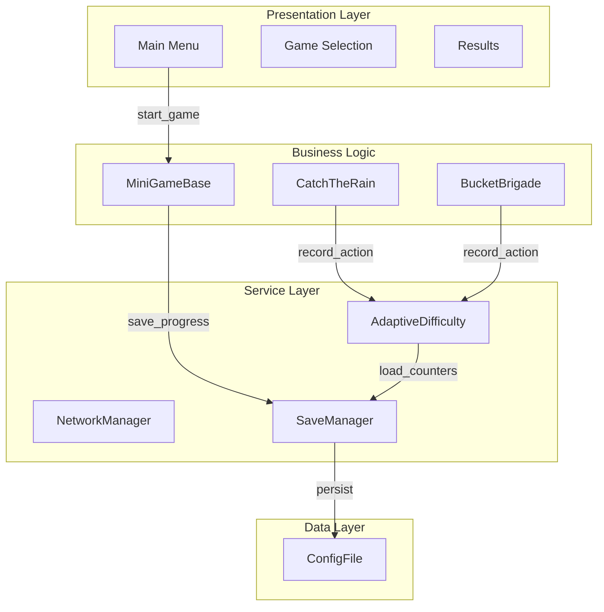
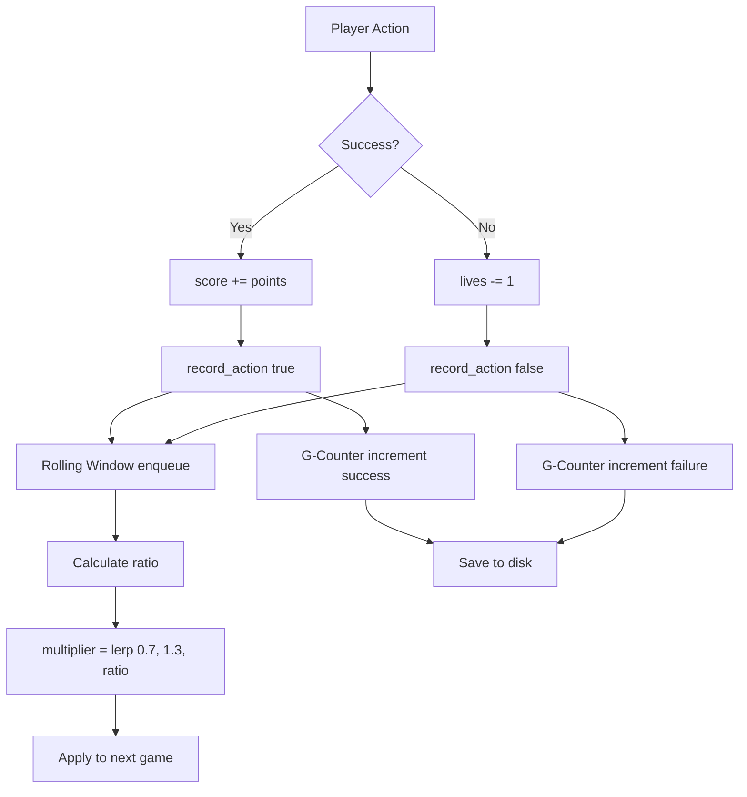

# WATERWISE GAME - COMPREHENSIVE DIAGRAM GENERATION PROMPT

This document contains detailed specifications for generating technical diagrams for the WaterWise educational game. Use this prompt with AI diagram generation tools (e.g., Mermaid, PlantUML, Draw.io AI, Lucidchart AI).

---

## 🎯 PROJECT OVERVIEW

**WaterWise** is an educational mobile game teaching water conservation through 10 mini-games. It uses adaptive AI (G-Counter CRDT + Rolling Window algorithms) to adjust difficulty and supports 2-player LAN cooperative multiplayer.

**Tech Stack:**
- Engine: Godot 4.x
- Language: GDScript
- Architecture: 4-tier layered (Presentation → Business Logic → Service → Data)
- Platforms: Android (primary), Windows/Linux (secondary)
- Languages: English, Filipino/Tagalog

---

## 📊 DIAGRAMS TO GENERATE

### 1. SYSTEM ARCHITECTURE DIAGRAM (4-Tier Layered)

**Type:** Layered architecture diagram with component details

**Requirements:**
- Show 4 distinct layers with clear boundaries
- Include all components within each layer
- Show data flow direction (arrows)
- Use different colors for each layer
- Include algorithm boxes in Layer 3

**LAYER 1: PRESENTATION LAYER (UI/UX)**
- Components:
  * MainMenu.tscn (title screen, game selection button)
  * GameSelection.tscn (10 mini-game grid with icons)
  * Settings.tscn (language toggle EN/TL, volume slider, colorblind mode)
  * Results.tscn (score display, stars 1-3, achievements, retry button)
  * Tutorial popups (first-time instructions)
  * HUD (score counter, timer, lives bar, pause button)
- Flow: User Input (touch/click) → UI Controller → Event Router → Layer 2

**LAYER 2: BUSINESS LOGIC LAYER (Game Engine Core)**
- Abstract Base Class:
  * MiniGameBase
    - Methods: _ready(), _process(delta), record_action(success: bool), end_game(victory: bool)
    - Variables: score, time_remaining, lives, game_active
    - Difficulty integration: apply_difficulty_settings(multiplier)
    - Scoring: calculate_final_score() = base_points + time_bonus + accuracy_bonus + combo_bonus

- 10 Mini-Games (all extend MiniGameBase):
  1. CatchTheRain (catch falling raindrops in bucket)
  2. BucketBrigade (pass buckets down a line, tap to pass)
  3. FixTheLeak (drag plugs to leaking pipes)
  4. GreywaterSorter (sort clean/dirty water)
  5. MudPieMaker (collect muddy water for plants)
  6. QuickShower (time-based shower control)
  7. SpotTheSpeck (find water waste in scene)
  8. TimingTap (tap at right moment to save water)
  9. TurnOffTheTap (close running taps quickly)
  10. SwipeSoap (swipe to lather without excess water)

- Game State: active, paused, ended
- Mechanics: collision detection, drag-drop, tap timing, swipe recognition

**LAYER 3: SERVICE LAYER (Autoload Managers)**

*Show each manager as a separate box with algorithms inside*

1. **AdaptiveDifficulty Manager** (RULE-BASED SYSTEM)
   
   - **Rolling Window Algorithm** (FIFO Queue):
     * Data Structure: Queue<Dictionary> with window_size = 3 (last 3 games)
     * Storage: accuracy (float), reaction_time (int), mistakes (int), timestamp, difficulty, game_name
     * Operations: 
       - enqueue(performance_data) → add new game result
       - dequeue() when size > 3 → remove oldest game
     * Adaptation Frequency: Every 2 games (after min 2 games played)
   
   - **Weighted Proficiency Index (Φ - Phi)**:
     * **Formula: Φ = WMA - CP**
     * **WMA (Weighted Moving Average):**
       - Formula: WMA = Σ(w_i × x_i) / Σ(w_i)
       - Weights: Linear (game 1: w=1, game 2: w=2, game 3: w=3)
       - Recent games have MORE weight (recency bias)
       - Example: [0.6, 0.7, 0.95] → (1×0.6 + 2×0.7 + 3×0.95) / 6 = 0.825
     * **CP (Consistency Penalty):**
       - Formula: CP = min(σ / 5000, 0.2)
       - σ (Sigma) = Standard Deviation of reaction times
       - σ = sqrt(Σ(x_i - μ)² / N)
       - Erratic timing → High penalty → Lower proficiency
       - Capped at 0.2 (20% maximum penalty)
     * **Proficiency Range:** -0.2 to 1.0
       - High Φ = Skilled + Consistent
       - Low Φ = Struggling OR Erratic
   
   - **Rule-Based Decision Tree**:
     * **RULE 1: STRUGGLING/ERRATIC → Easy**
       - Condition: Φ < 0.5
       - Reasons: Low accuracy OR High inconsistency
       - Action: Set difficulty = "Easy"
     * **RULE 2: MASTERY+CONSISTENCY → Hard**
       - Condition: Φ > 0.85
       - Reasons: High accuracy AND Low inconsistency
       - Action: Set difficulty = "Hard"
     * **RULE 3: FLOW STATE → Medium**
       - Condition: 0.5 ≤ Φ ≤ 0.85
       - Reasons: Balanced performance in learning zone
       - Action: Set difficulty = "Medium"
   
   - **G-Counter CRDT Algorithm** (Long-Term Tracking):
     * Variables: success_counter (int), failure_counter (int)
     * Increment: IF success: success_counter++ ELSE: failure_counter++
     * Lifetime Ratio: ratio = success_counter / (success_counter + failure_counter)
     * Recommendation: IF ratio > 0.8: "Hard" ELIF ratio > 0.5: "Medium" ELSE: "Easy"
     * Persistence: Saved to ConfigFile [difficulty] section
   
   - **Application to Game Parameters**:
     * spawn_interval = base_interval / speed_multiplier
     * object_speed = base_speed × speed_multiplier
     * bucket_width = base_width / speed_multiplier
     * target_count = base_target × task_complexity
     * time_limit = difficulty setting (Easy: 20s, Medium: 15s, Hard: 10s)
     * hints = difficulty setting (Easy: 3, Medium: 2, Hard: 1)
     * chaos_effects = [] for Easy/Medium, [screen_shake, mud_splatter, buzzing_fly, control_reverse] for Hard

2. **CoopAdaptation Manager** (Multiplayer Load Balancing)
   
   - **Purpose**: Distribute tasks based on skill difference in 2-player co-op
   - **Algorithm**: Skill-based task reallocation
   
   - **Formula**:
     ```
     Load_ratio = Skill_A / (Skill_A + Skill_B)
     
     where:
     Skill_A = running average of Player A's accuracy (last 5 games)
     Skill_B = running average of Player B's accuracy (last 5 games)
     
     Task_count_A = total_tasks × Load_ratio
     Task_count_B = total_tasks × (1 - Load_ratio)
     ```
   
   - **Example**:
     ```
     Player A accuracy = 0.8 (strong player)
     Player B accuracy = 0.5 (weak player)
     
     Load_ratio = 0.8 / (0.8 + 0.5) = 0.8 / 1.3 ≈ 0.615
     
     If total_tasks = 10:
       Player A gets 10 × 0.615 = 6-7 tasks (harder)
       Player B gets 10 × 0.385 = 3-4 tasks (easier)
     ```
   
   - **Edge Cases**:
     * If skill_difference > 0.4 → Cap at 70/30 split (prevent carrying)
     * If one player disconnects → Other player gets 100% of tasks
     * If both players new → Default 50/50 split
   
   - **Network Sync**:
     * Each peer reports: {peer_id, accuracy, reaction_time, mistakes}
     * Host calculates Load_ratio
     * Host broadcasts task assignments via RPC
   
   - **Output**: Dictionary {peer_id_A: task_count_A, peer_id_B: task_count_B}

3. **NetworkManager (G-Counter CRDT)**
   
   - **Purpose**: Conflict-free distributed score tracking in multiplayer
   - **Protocol**: UDP/ENet (low latency, 2-player co-op)
   - **Port**: 7777 (default), configurable
   - **Architecture**: Host-Client (max 2 peers)
   
   - **G-Counter Algorithm** (Conflict-Free Replicated Data Type):
     ```
     Data Structure:
       g_counter: Dictionary<int, int> = {
         peer_id_1: local_score_1,
         peer_id_2: local_score_2
       }
     
     Operations:
       1. Increment (local only):
          g_counter[my_peer_id] += points
       
       2. Query (global sum):
          GlobalScore = Σ g_counter[peer_id] for all peers
       
       3. Merge (on network sync):
          for each peer_id in received_counter:
            g_counter[peer_id] = max(g_counter[peer_id], received_counter[peer_id])
     ```
   
   - **Properties**:
     * **Commutative**: Order of updates doesn't matter
     * **Idempotent**: Duplicate messages don't cause errors
     * **Monotonic**: Counters only increase (no decrements)
     * **Eventually Consistent**: All peers converge to same global score
   
   - **Example (2 Players)**:
     ```
     Game Start:
       g_counter = {peer_1: 0, peer_2: 0}
     
     Player 1 catches 3 items:
       g_counter[peer_1] = 3
       RPC broadcast to peer_2
     
     Player 2 catches 5 items:
       g_counter[peer_2] = 5
       RPC broadcast to peer_1
     
     Both peers now have:
       g_counter = {peer_1: 3, peer_2: 5}
       GlobalScore = 3 + 5 = 8
     
     Win Condition Check:
       IF GlobalScore >= LEVEL_QUOTA (20):
         team_won.emit()
     ```
   
   - **Network Sync**:
     * Frequency: Every action (item caught/missed) + heartbeat every 100ms
     * RPC Call: submit_score(points: int) → Updates sender's counter
     * Conflict Resolution: None needed (CRDTs are conflict-free by design)
   
   - **Packet Structure**:
     ```
     {
       "action": "score_update",
       "peer_id": int,
       "points": int,
       "timestamp": int,
       "g_counter": {peer_1: int, peer_2: int}
     }
     ```
   
   - **Discovery**: Broadcast UDP packets on LAN (255.255.255.255:7777)
   - **Latency**: <50ms average (local network)
   - **Outputs**: 
     * get_global_score() → int (sum of all peer counters)
     * Team victory signal when LEVEL_QUOTA reached

4. **SaveManager**
   - File Format: ConfigFile (INI-like)
   - Path: user://waterwise_save.cfg
   - Sections: [game], [settings], [achievements], [difficulty]
   - Operations: save() after each game, load() on startup

5. **Localization**
   - Languages: English (EN), Filipino/Tagalog (TL)
   - Format: CSV dictionary
   - Runtime switching: no restart required

6. **AccessibilityManager**
   - Colorblind mode (high contrast)
   - Large touch targets (80-100px)
   - Audio cues for actions

7. **AudioManager**
   - Procedural SFX generation (no external files)
   - Looping background music

8. **TutorialManager**
   - First-time popups per game
   - Flag storage: tutorial_shown_{game_id}: bool

9. **GameManager**
   - Global state management
   - Progress tracking
   - Scene transitions

10. **ThemeManager**
    - Dark/Light mode
    - UI styling

**LAYER 4: DATA PERSISTENCE LAYER**
- ConfigFile Structure:
  ```
  [game]
  high_score_catch_rain = 500
  high_score_bucket_brigade = 350
  droplets_collected = 1250
  games_played = 42
  
  [settings]
  language = "en"
  volume = 0.8
  colorblind_mode = false
  
  [achievements]
  first_game = true
  water_saver = true
  perfect_round = false
  
  [difficulty]
  success_counter = 87
  failure_counter = 35
  recommended_level = "medium"
  ```
- File Location: user:// folder (platform-specific)
- Operations: DirAccess.open(), ConfigFile.load(), ConfigFile.save()

**Data Flow Arrows:**
- Layer 1 → Layer 2: UI events trigger game logic
- Layer 2 → Layer 3: Games call record_action() on managers
- Layer 3 → Layer 4: Managers persist data via SaveManager
- Layer 4 → Layer 3: Load saved data on startup
- Layer 3 → Layer 2: Provide difficulty_multiplier to games
- Layer 2 → Layer 1: Update UI displays (score, timer, etc.)

---

### 2. ALGORITHM FLOW DIAGRAM (How Algorithms Integrate)

**Type:** Flowchart showing algorithm execution from player action to difficulty adjustment

**Flow Steps:**

1. **PLAYER ACTION** (Input Event)
   - Examples: Tap bucket, Swipe left, Drag plug
   - Captured by Layer 1 (UI)

2. **GAME LOGIC PROCESSING** (Layer 2)
   ```
   MiniGameBase::record_action(success: bool)
   │
   ├─ total_actions++
   │
   ├─ IF success:
   │   ├─ correct_actions++
   │   ├─ current_score += 10  // Fixed increment per correct action
   │   │   └─ SCORING FORMULA (Simple):
   │   │       score = correct_actions × 10
   │   │       Example: 15 correct → 150 points
   │   │
   │   └─ show_success_feedback()
   │       └─ Play "pop" SFX + green particle burst
   │
   └─ ELSE (mistake):
       ├─ mistakes_made++
       ├─ time_penalty = 2.0s (subtracted from remaining time)
       │   └─ Mistake Cost: Less time to complete task
       │
       └─ show_failure_feedback()
           └─ Flash timer red + shake animation
   │
   ├─ update_ui()
   │   └─ score_label.text = "⭐ " + str(current_score)
   │
   └─ AdaptiveDifficulty.record_action(success)
   
   END GAME TRIGGERS:
     ├─ Timer runs out (survival mode → SUCCESS, quota mode → FAIL)
     └─ Player reaches target (quota mode → SUCCESS)
   
   FINAL METRICS CALCULATION:
     accuracy = correct_actions / total_actions
     reaction_time = (game_duration - remaining_time) × 1000  // in ms
     final_score = current_score  // Already accumulated
   
   SEND TO ADAPTIVE SYSTEM:
     AdaptiveDifficulty.complete_minigame(
       game_name,
       accuracy,      // float 0.0-1.0
       reaction_time, // int milliseconds
       mistakes_made  // int count
     )
   ```

3. **ROLLING WINDOW ALGORITHM** (Rule-Based with Weighted Proficiency Index)
   ```
   ╔════════════════════════════════════════════════════════════════════╗
   ║ ROLLING WINDOW: Queue<Dictionary> (window_size = 3)                ║
   ╚════════════════════════════════════════════════════════════════════╝
   
   DATA STRUCTURE:
   performance_window[3] = [
     {accuracy: 0.6, reaction_time: 5000ms, mistakes: 3, ...},
     {accuracy: 0.7, reaction_time: 6000ms, mistakes: 2, ...},
     {accuracy: 0.95, reaction_time: 5500ms, mistakes: 1, ...}
   ]
   
   ENQUEUE(performance_data):
     IF window.size() >= 3:
       window.pop_front()  // Remove oldest game (FIFO)
     window.append(performance_data)
   
   ═══════════════════════════════════════════════════════════════════
   STEP 1: CALCULATE WEIGHTED MOVING AVERAGE (WMA)
   ═══════════════════════════════════════════════════════════════════
   
   Formula: WMA = Σ(w_i × accuracy_i) / Σ(w_i)
   
   Weights (Linear, Recency Bias):
     Game 1 (oldest):  w = 1
     Game 2:           w = 2
     Game 3 (newest):  w = 3
   
   Example Calculation:
     weighted_sum = (1 × 0.6) + (2 × 0.7) + (3 × 0.95)
                  = 0.6 + 1.4 + 2.85 = 4.85
     
     weight_sum = 1 + 2 + 3 = 6
     
     WMA = 4.85 / 6 = 0.808
   
   ═══════════════════════════════════════════════════════════════════
   STEP 2: CALCULATE CONSISTENCY PENALTY (CP)
   ═══════════════════════════════════════════════════════════════════
   
   A. Calculate Mean Reaction Time (μ):
     μ = (5000 + 6000 + 5500) / 3 = 5500ms
   
   B. Calculate Variance (σ²):
     deviations = [5000-5500, 6000-5500, 5500-5500]
                = [-500, 500, 0]
     
     squared = [250000, 250000, 0]
     
     variance = (250000 + 250000 + 0) / 3 = 166667
   
   C. Calculate Standard Deviation (σ):
     σ = sqrt(166667) ≈ 408.2ms
   
   D. Normalize to Penalty:
     CP = min(σ / 5000, 0.2)
        = min(408.2 / 5000, 0.2)
        = min(0.0816, 0.2)
        = 0.0816
   
   ═══════════════════════════════════════════════════════════════════
   STEP 3: CALCULATE PROFICIENCY INDEX (Φ - Phi)
   ═══════════════════════════════════════════════════════════════════
   
   Formula: Φ = WMA - CP
   
   Φ = 0.808 - 0.0816 = 0.726
   
   Interpretation:
     - Φ = 0.726 (Flow State, Medium Difficulty)
     - High accuracy (80.8% weighted)
     - Low inconsistency (408ms σ, only 8% penalty)
   
   ═══════════════════════════════════════════════════════════════════
   STEP 4: RULE-BASED DECISION TREE
   ═══════════════════════════════════════════════════════════════════
   
   RULE 1: IF Φ < 0.5 → Easy
     ├─ Low accuracy (<50% weighted) OR
     └─ High inconsistency (>2500ms σ → 20% penalty)
     Action: Set difficulty = "Easy"
     Reason: Player struggling or erratic, needs support
   
   RULE 2: IF Φ > 0.85 → Hard
     ├─ High accuracy (>85% weighted) AND
     └─ Low inconsistency (<750ms σ → <15% penalty)
     Action: Set difficulty = "Hard"
     Reason: Mastery + Consistency, ready for challenge
   
   RULE 3: ELSE (0.5 ≤ Φ ≤ 0.85) → Medium
     └─ Balanced performance in learning zone
     Action: Set difficulty = "Medium"
     Reason: Flow state, optimal engagement
   
   Current Φ = 0.726:
     [✓] 0.5 ≤ 0.726 ≤ 0.85 → MEDIUM (Rule 3 triggered)
   
   ═══════════════════════════════════════════════════════════════════
   OUTPUT: NEW DIFFICULTY
   ═══════════════════════════════════════════════════════════════════
   
   new_difficulty = "Medium"
   reason = "Flow state - Optimal proficiency (Φ=0.73): Balanced performance in learning zone"
   
   // ratio=0.0 → 0.7 (easy)     [OLD SYSTEM - DEPRECATED]
   // ratio=0.5 → 1.0 (medium)
   // ratio=1.0 → 1.3 (hard)
   ```

4. **G-COUNTER ALGORITHM** (Long-Term Tracking - DEPRECATED in Latest Version)
   ```
   NOTE: This is for LONG-TERM performance tracking across sessions.
   The Rolling Window (above) handles SHORT-TERM adaptive difficulty.
   
   success_counter: int = 0  // Persistent across app restarts
   failure_counter: int = 0
   
   INCREMENT (after each game):
     IF accuracy > 0.5:  // Over 50% success rate
       success_counter += 1
     ELSE:
       failure_counter += 1
   
   LIFETIME RATIO:
     total_games = success_counter + failure_counter
     lifetime_ratio = success_counter / total_games
   
   LONG-TERM RECOMMENDATION (not actively used):
     IF lifetime_ratio > 0.8:
       recommended_difficulty = "Hard"
     ELIF lifetime_ratio > 0.5:
       recommended_difficulty = "Medium"
     ELSE:
       recommended_difficulty = "Easy"
   
   PERSISTENCE:
     SaveManager.save_value("difficulty", "success_counter", success_counter)
     SaveManager.save_value("difficulty", "failure_counter", failure_counter)
   
   NOTE: Current system prioritizes Rolling Window (last 3 games) over
   lifetime stats for more responsive difficulty adaptation.
   ```

5. **APPLY DIFFICULTY ADJUSTMENTS**
   ```
   ╔════════════════════════════════════════════════════════════════════╗
   ║ DIFFICULTY SETTINGS (CHAOS SYSTEM)                                 ║
   ╚════════════════════════════════════════════════════════════════════╝
   
   Based on new_difficulty from decision tree:
   
   ═══════════════════════════════════════════════════════════════════
   EASY (Φ < 0.5 - Struggling/Erratic)
   ═══════════════════════════════════════════════════════════════════
   
   speed_multiplier: 0.7 (30% slower)
   time_limit: 20 seconds
   task_complexity: 1 (simplest tasks)
   hints: 3 (maximum guidance)
   visual_guidance: true (arrows, highlights)
   distractors: 1 (minimal chaos)
   item_count: 3 (few objects to manage)
   chaos_effects: [] (no disruptions)
   
   Game Parameters Example:
     spawn_interval = 2.0s / 0.7 = 2.86s (slower spawning)
     object_speed = 200px/s × 0.7 = 140px/s (slower movement)
     bucket_width = 100px / 0.7 = 143px (larger target)
   
   ═══════════════════════════════════════════════════════════════════
   MEDIUM (0.5 ≤ Φ ≤ 0.85 - Flow State)
   ═══════════════════════════════════════════════════════════════════
   
   speed_multiplier: 1.0 (normal speed)
   time_limit: 15 seconds
   task_complexity: 2 (moderate tasks)
   hints: 2 (some guidance)
   visual_guidance: false (player must recognize patterns)
   distractors: 2 (moderate chaos)
   item_count: 5 (balanced object count)
   chaos_effects: ["screen_shake_mild"] (light disruption)
   
   Game Parameters Example:
     spawn_interval = 2.0s / 1.0 = 2.0s (normal spawning)
     object_speed = 200px/s × 1.0 = 200px/s (normal movement)
     bucket_width = 100px / 1.0 = 100px (normal target)
   
   ═══════════════════════════════════════════════════════════════════
   HARD (Φ > 0.85 - Mastery+Consistency)
   ═══════════════════════════════════════════════════════════════════
   
   speed_multiplier: 1.5 (50% faster)
   time_limit: 10 seconds
   task_complexity: 3 (complex multi-step tasks)
   hints: 1 (minimal guidance)
   visual_guidance: false (no hints)
   distractors: 3 (high chaos)
   item_count: 8 (many objects to manage)
   chaos_effects: [
     "screen_shake_heavy"    // Strong camera shake
     "mud_splatters"         // Visual obstructions
     "buzzing_fly"           // Animated distractor
     "control_reverse"       // Left = Right for 2s
     "visual_obstruction"    // Temporary screen darkening
   ]
   
   Game Parameters Example:
     spawn_interval = 2.0s / 1.5 = 1.33s (faster spawning)
     object_speed = 200px/s × 1.5 = 300px/s (faster movement)
     bucket_width = 100px / 1.5 = 67px (smaller target)
   
   ═══════════════════════════════════════════════════════════════════
   CHAOS EFFECTS (Hard Mode Only)
   ═══════════════════════════════════════════════════════════════════
   
   1. screen_shake_heavy:
      - Intensity: 1.0 (full shake)
      - Camera offset: ±20px random
      - Frequency: Every 2-3 seconds
   
   2. mud_splatters:
      - Random mud drops on screen
      - Blocks 10-15% of viewport
      - Fades after 2 seconds
   
   3. buzzing_fly:
      - Animated fly crosses screen
      - Follows random Bezier path
      - Speed: 300px/s
      - Can overlap game objects
   
   4. control_reverse:
      - Swaps input directions
      - Left touch → Move right
      - Right touch → Move left
      - Duration: 2 seconds
      - Warning: "Controls Reversed!" text
   
   5. visual_obstruction:
      - Screen darkens to 50% brightness
      - Random fog effect
      - Duration: 1.5 seconds
      - Creates urgency
   
   ```

6. **MULTIPLAYER COOPERATIVE ADAPTATION** (If 2 Players)
   ```
   Player 1: accuracy = 0.85 (doing well)
   Player 2: accuracy = 0.60 (struggling)
   
   diff = |0.85 - 0.60| = 0.25
   
   IF diff > 0.20:
     weaker_adjustment = 0.85   // Make P2 easier
     stronger_adjustment = 1.08 // Make P1 harder
     
     P1_multiplier *= stronger_adjustment  (1.0 → 1.08)
     P2_multiplier *= weaker_adjustment    (1.0 → 0.85)
   
   RESULT: Games become more balanced, team plays together
   ```

7. **SCORE CALCULATION**
   ```
   Example with 15 correct, 2 incorrect, 18s used, 30s limit, 3 combos:
   
   base_points = 15 × 10 = 150
   time_bonus = max(0, (30 - 18) × 5) = 60
   accuracy = 15 / 17 = 0.88
   accuracy_bonus = 0.88 × 100 = 88
   combo_bonus = 3 × 5 = 15
   
   final_score = 150 + 60 + 88 + 15 = 313
   
   stars_earned:
     IF accuracy >= 0.9: 3 stars ⭐⭐⭐
     ELIF accuracy >= 0.7: 2 stars ⭐⭐  ← Result
     ELIF accuracy >= 0.5: 1 star ⭐
   ```

**Diagram Should Show:**
- Decision diamonds for IF/ELSE logic
- Process boxes for calculations
- Data stores for G-Counter and Rolling Window
- Feedback loops (difficulty affects next game)
- Parallel paths for single-player vs multiplayer

---

### 3. DATA FLOW DIAGRAM (Complete Game Session)

**Type:** Sequence diagram or data flow diagram

**Lifecycle Phases:**

**PHASE 1: APP LAUNCH**
```
[User] → Launch App
  ↓
[GameManager]._ready()
  ↓
[SaveManager].load_from_disk()
  ↓ Read user://waterwise_save.cfg
[ConfigFile] → Parse sections: [game], [settings], [achievements], [difficulty]
  ↓
[AdaptiveDifficulty].initialize()
  ├─ Load G-Counter values (success: 87, failure: 35)
  └─ Initialize empty Rolling Window Queue<bool>[10]
  ↓
[Localization].set_language(saved_language)
  ↓
[InitialScreen].show() → Display Main Menu
```

**PHASE 2: GAME START**
```
[User] → Select Mini-Game (e.g., "Catch The Rain")
  ↓
[GameManager].start_next_minigame("catch_rain")
  ↓
[AdaptiveDifficulty].get_recommended_difficulty()
  ├─ G-Counter lifetime_ratio = 87/(87+35) = 0.71 → "Medium"
  └─ Return base difficulty: "medium"
  ↓
[GameManager].load_scene("res://scenes/minigames/CatchTheRain.tscn")
  ↓
[CatchTheRain]._ready()
  ├─ Set base parameters (medium: spawn_interval=2s, speed=200px/s)
  ├─ Get Rolling Window multiplier (initial = 1.0)
  └─ Apply: spawn_interval=2s/1.0=2s, speed=200px/s×1.0=200px/s
  ↓
[TutorialManager].should_show_tutorial("catch_rain")?
  ├─ IF first_time: Show popup with instructions
  └─ ELSE: Skip to countdown
  ↓
Start countdown: "3... 2... 1... GO!"
  ↓
game_active = true
```

**PHASE 3: GAME LOOP (60 FPS)**
```
[CatchTheRain]._process(delta = 0.0167s)
  ↓
Update timer: time_remaining -= delta
  ↓
Update objects: raindrop.position.y += speed × delta
  ↓
Check collisions: bucket.overlaps_area(raindrop)?
  ├─ IF collision:
  │   ├─ IF raindrop.is_good:
  │   │   ├─ record_action(true)
  │   │   ├─ score += 10
  │   │   └─ show_success_feedback() → Flash green, play ding
  │   └─ ELSE (bad drop):
  │       ├─ record_action(false)
  │       ├─ lives -= 1
  │       └─ show_failure_feedback() → Flash red, shake
  │
  ├─ record_action(success) calls:
  │   ├─ [AdaptiveDifficulty].record_action(success)
  │   │   ├─ Rolling Window: enqueue(success)
  │   │   │   └─ Recalculate multiplier: now 1.15 (player doing well)
  │   │   └─ G-Counter: IF success: success_counter++ ELSE: failure_counter++
  │   │
  │   └─ IF multiplayer:
  │       [NetworkManager].sync_performance({score, accuracy, time})
  │       └─ Send UDP packet to partner
  │
  └─ Check win/lose:
      ├─ IF score >= target: end_game(true)
      ├─ IF lives <= 0: end_game(false)
      └─ IF time <= 0: end_game(false)
```

**PHASE 4: GAME END**
```
[CatchTheRain].end_game(victory = true)
  ↓
calculate_final_score()
  ├─ base_points = 15 × 10 = 150
  ├─ time_bonus = (30 - 18) × 5 = 60
  ├─ accuracy_bonus = 0.88 × 100 = 88
  ├─ combo_bonus = 3 × 5 = 15
  └─ final_score = 313
  ↓
[SaveManager].update_progress()
  ├─ Check if new high score (313 > saved 280? YES)
  ├─ Update high_score_catch_rain = 313
  ├─ games_played += 1
  └─ Check achievements: IF first_game == false: unlock achievement
  ↓
[SaveManager].save_to_disk()
  ├─ ConfigFile.set_value("game", "high_score_catch_rain", 313)
  ├─ ConfigFile.set_value("difficulty", "success_counter", 102)
  ├─ ConfigFile.set_value("difficulty", "failure_counter", 37)
  └─ ConfigFile.save("user://waterwise_save.cfg")
  ↓
[Results].show(score=313, stars=2, achievements=["First Win!"])
  ↓
[User] → Click "Continue"
  ↓
Return to Game Selection Screen
```

**PHASE 5: MULTIPLAYER SESSION**
```
[Host Player] → Click "Multiplayer" → "Host Game"
  ↓
[NetworkManager].create_host()
  ├─ Create UDP server on port 7777
  ├─ Broadcast discovery packets every 1s
  └─ Wait for client connection
  ↓
[Client Player] → Click "Multiplayer" → "Join Game"
  ↓
[NetworkManager].scan_for_hosts()
  ├─ Listen for UDP broadcasts (5 second timeout)
  ├─ Display found hosts in list
  └─ [Client] selects host and connects
  ↓
Connection established → Both players ready
  ↓
[Host] starts game → [Client] syncs and starts same game
  ↓
DURING GAME (every action):
  [Player1].record_action(success)
    ↓
  [NetworkManager].sync_performance()
    └─ Send {player_id: 1, score: 50, accuracy: 0.85, time: 12}
    ↓
  [Player2] receives packet
    ↓
  [CoopAdaptation].update_metrics(partner_data)
    ├─ Calculate diff = |0.85 - 0.60| = 0.25
    ├─ Apply adjustments: P1: 1.08x, P2: 0.85x
    └─ Update difficulty_multiplier for each player
  ↓
GAME END:
  Both players finish → Exchange final scores
    ↓
  Calculate team_score = (P1_score + P2_score) / 2
    ↓
  Show team results: "Team Score: 450! You saved 120 liters together!"
```

**Diagram Should Show:**
- Actors: User, System, Network
- Processes: rectangular boxes
- Data stores: cylinders
- Decision points: diamonds
- Communication: dashed arrows for network
- Time flow: top to bottom

---

### 4. USE CASE DIAGRAM

**Type:** UML Use Case Diagram

**Actors:**
1. **Player** (primary user, child 6-12 years old)
2. **Player 2** (optional, for multiplayer)
3. **System** (internal actor for automated processes)
4. **Network** (external system for LAN communication)

**Use Cases:**

**UC-01: Play Mini-Game**
- Actor: Player
- Preconditions: App launched, game selected
- Flow:
  1. Player selects mini-game from grid
  2. System loads game scene
  3. System applies difficulty settings (from AdaptiveDifficulty)
  4. System shows tutorial (if first time)
  5. Game starts with countdown
  6. Player interacts (tap/swipe/drag)
  7. System records actions and updates score
  8. Game ends (win/lose/timeout)
  9. System shows results screen
- Postconditions: Progress saved, high score updated
- Includes: <<Apply Difficulty>>, <<Record Actions>>, <<Save Progress>>

**UC-02: Adjust Difficulty (Automated)**
- Actor: System (AdaptiveDifficulty)
- Trigger: Player completes action
- Flow:
  1. System receives action result (success/failure)
  2. G-Counter increments appropriate counter
  3. Rolling Window enqueues action, dequeues oldest if size > 10
  4. System calculates new difficulty multiplier
  5. Next game uses updated multiplier
- Postconditions: difficulty_multiplier updated (0.7 - 1.3 range)
- Extended by: UC-01

**UC-03: Host Multiplayer Game**
- Actor: Player (Host)
- Preconditions: LAN network available
- Flow:
  1. Player clicks "Multiplayer" → "Host Game"
  2. System creates UDP server on port 7777
  3. System broadcasts discovery packets
  4. System waits for client connection (shows waiting screen)
  5. Client connects
  6. Host starts game
  7. Both players play synchronized game
  8. System balances difficulty via CoopAdaptation
  9. Game ends, team score calculated
- Postconditions: Both players' progress saved
- Includes: <<Network Communication>>, <<Load Balance Difficulty>>

**UC-04: Join Multiplayer Game**
- Actor: Player (Client)
- Preconditions: Host game active on LAN
- Flow:
  1. Player clicks "Multiplayer" → "Join Game"
  2. System scans for UDP broadcasts (5s timeout)
  3. System displays available hosts
  4. Player selects host
  5. System connects to host
  6. Game starts when host initiates
  7. Player plays synchronized game
  8. Game ends, team score calculated
- Postconditions: Player's progress saved
- Includes: <<Network Communication>>

**UC-05: Change Settings**
- Actor: Player
- Flow:
  1. Player clicks Settings button
  2. Player toggles language (EN ↔ TL)
  3. Player adjusts volume slider
  4. Player enables/disables colorblind mode
  5. Player clicks Save
  6. System persists settings to ConfigFile
  7. System applies settings immediately
- Postconditions: Settings saved and active
- Includes: <<Save Progress>>

**UC-06: View Achievements**
- Actor: Player
- Flow:
  1. Player clicks Achievements button
  2. System loads achievement data from save file
  3. System displays grid of achievements (locked/unlocked)
  4. Player sees progress (e.g., "10/15 unlocked")
- Postconditions: None (read-only)

**UC-07: Save Progress (Automated)**
- Actor: System (SaveManager)
- Trigger: Game ends, settings changed
- Flow:
  1. System collects data to save:
     - High scores per game
     - Total droplets collected
     - Games played counter
     - G-Counter values
     - Achievements unlocked
     - Settings (language, volume, colorblind)
  2. System writes to ConfigFile
  3. System saves to user://waterwise_save.cfg
- Postconditions: Data persisted to disk
- Extended by: UC-01, UC-05

**UC-08: Load Progress (Automated)**
- Actor: System (SaveManager)
- Trigger: App launch
- Flow:
  1. System checks if save file exists
  2. IF exists: Load ConfigFile
  3. System parses all sections
  4. System initializes managers with saved data
  5. ELSE: Create new save with defaults
- Postconditions: Game state restored

**Relationships:**
- UC-01 <<includes>> UC-02 (difficulty always applied)
- UC-01 <<includes>> UC-07 (progress always saved)
- UC-03 <<includes>> UC-02 (multiplayer uses adaptive difficulty)
- UC-03 <<includes>> UC-07 (multiplayer saves progress)
- UC-05 <<includes>> UC-07 (settings trigger save)
- App Launch <<triggers>> UC-08

**Diagram Should Show:**
- Stick figures for actors (Player, Player 2)
- Ovals for use cases
- Lines connecting actors to use cases
- <<include>>, <<extend>>, <<triggers>> relationships with dashed arrows
- System boundary box around all use cases

---

### 5. CLASS DIAGRAM (Core Classes)

**Type:** UML Class Diagram

**Classes to Include:**

**1. MiniGameBase (Abstract)**
```
┌─────────────────────────────────┐
│     <<abstract>>                │
│     MiniGameBase                │
├─────────────────────────────────┤
│ # score: int                    │
│ # time_remaining: float         │
│ # lives: int                    │
│ # game_active: bool             │
│ # difficulty_multiplier: float  │
│ # spawn_interval: float         │
│ # object_speed: float           │
├─────────────────────────────────┤
│ + _ready(): void                │
│ + _process(delta: float): void  │
│ + record_action(success: bool)  │
│ + apply_difficulty_settings()   │
│ + calculate_final_score(): int  │
│ + end_game(victory: bool): void │
│ # show_success_feedback()       │
│ # show_failure_feedback()       │
└─────────────────────────────────┘
```

**2. CatchTheRain (extends MiniGameBase)**
```
┌─────────────────────────────────┐
│     CatchTheRain                │
├─────────────────────────────────┤
│ - bucket_position: Vector2      │
│ - raindrops: Array[Raindrop]    │
│ - spawn_timer: float            │
│ - drops_caught: int             │
│ - target_drops: int = 15        │
├─────────────────────────────────┤
│ + _ready(): void                │
│ + _process(delta: float): void  │
│ - spawn_raindrop(): void        │
│ - create_bucket(): void         │
└─────────────────────────────────┘
```

**3. AdaptiveDifficulty (Autoload Singleton)**
```
┌─────────────────────────────────┐
│   AdaptiveDifficulty            │
├─────────────────────────────────┤
│ - success_counter: int          │
│ - failure_counter: int          │
│ - rolling_window: Array[bool]   │
│ - window_size: int = 10         │
│ - current_multiplier: float     │
├─────────────────────────────────┤
│ + record_action(success: bool)  │
│ + get_multiplier(): float       │
│ + get_recommended_diff(): String│
│ - calculate_gcounter_ratio()    │
│ - calculate_window_ratio()      │
│ - update_multiplier(): void     │
│ + save_counters(): void         │
│ + load_counters(): void         │
└─────────────────────────────────┘
```

**4. NetworkManager (Autoload Singleton)**
```
┌─────────────────────────────────┐
│     NetworkManager              │
├─────────────────────────────────┤
│ - peer: ENetMultiplayerPeer     │
│ - is_host: bool                 │
│ - connected_peers: Array[int]   │
│ - discovery_port: int = 7777    │
├─────────────────────────────────┤
│ + create_host(): void           │
│ + join_host(ip: String): void   │
│ + scan_for_hosts(): Array       │
│ + sync_performance(data: Dict)  │
│ + disconnect_session(): void    │
│ - broadcast_discovery(): void   │
│ - on_peer_connected(id: int)    │
│ - on_peer_disconnected(id: int) │
└─────────────────────────────────┘
```

**5. SaveManager (Autoload Singleton)**
```
┌─────────────────────────────────┐
│     SaveManager                 │
├─────────────────────────────────┤
│ - config: ConfigFile            │
│ - save_path: String             │
│ - progress_data: Dictionary     │
│ - settings_data: Dictionary     │
│ - achievements: Dictionary      │
├─────────────────────────────────┤
│ + save_to_disk(): void          │
│ + load_from_disk(): void        │
│ + update_high_score(game, score)│
│ + unlock_achievement(id: String)│
│ + get_setting(key: String): Var │
│ + set_setting(key: String, val) │
│ - create_default_save(): void   │
└─────────────────────────────────┘
```

**6. CoopAdaptation (Autoload Singleton)**
```
┌─────────────────────────────────┐
│   CoopAdaptation                │
├─────────────────────────────────┤
│ - player1_accuracy: float       │
│ - player2_accuracy: float       │
│ - balance_threshold: float=0.2  │
│ - weaker_adjustment: float      │
│ - stronger_adjustment: float    │
├─────────────────────────────────┤
│ + update_metrics(p1_acc, p2_acc)│
│ + get_adjustment(player_id): flt│
│ - calculate_difference(): float │
│ - apply_balancing(): void       │
└─────────────────────────────────┘
```

**Relationships:**
- CatchTheRain ──▷ MiniGameBase (inheritance)
- BucketBrigade ──▷ MiniGameBase (inheritance)
- (8 more mini-games) ──▷ MiniGameBase (inheritance)
- MiniGameBase ──→ AdaptiveDifficulty (dependency, calls record_action)
- MiniGameBase ──→ SaveManager (dependency, calls save methods)
- MiniGameBase ──→ NetworkManager (dependency, multiplayer sync)
- NetworkManager ──→ CoopAdaptation (dependency, uses for balancing)
- SaveManager ──→ AdaptiveDifficulty (dependency, persists G-Counter)

**Diagram Should Show:**
- Classes as boxes with 3 sections (name, attributes, methods)
- Inheritance arrows (hollow triangle)
- Dependency arrows (dashed with arrow)
- Visibility: + public, # protected, - private
- Data types for all attributes and parameters

---

### 6. ENTITY-RELATIONSHIP DIAGRAM (Save Data)

**Type:** ER Diagram for ConfigFile structure

**Entities:**

**1. GameProgress**
- Attributes:
  * game_id (PK): String (e.g., "catch_rain")
  * high_score: int
  * stars_earned: int (1-3)
  * times_played: int
  * best_accuracy: float

**2. PlayerSettings**
- Attributes:
  * setting_id (PK): String
  * language: String ("en" | "tl")
  * volume: float (0.0 - 1.0)
  * colorblind_mode: bool
  * tutorial_reset: bool

**3. Achievement**
- Attributes:
  * achievement_id (PK): String
  * unlocked: bool
  * unlock_date: String (ISO 8601)
  * description: String

**4. DifficultyData**
- Attributes:
  * difficulty_id (PK): int (always 1, singleton)
  * success_counter: int
  * failure_counter: int
  * lifetime_ratio: float
  * recommended_level: String ("easy"|"medium"|"hard")

**5. GlobalStats**
- Attributes:
  * stat_id (PK): int (always 1)
  * total_droplets: int
  * games_played: int
  * total_playtime: int (seconds)
  * first_launch: bool

**Relationships:**
- GameProgress (1) ←→ (1) GlobalStats (aggregated into total stats)
- Achievement (N) ←→ (1) GlobalStats (tracks total unlocked count)
- DifficultyData (1) ←→ (1) GlobalStats (linked to overall performance)
- PlayerSettings (1) ←→ (1) GlobalStats (user preferences)

**ConfigFile Mapping:**
```
[game]  → GameProgress entity (multiple keys per game)
[settings] → PlayerSettings entity
[achievements] → Achievement entity (multiple keys)
[difficulty] → DifficultyData entity
[global] → GlobalStats entity
```

**Diagram Should Show:**
- Rectangles for entities
- Ovals for attributes
- Diamonds for relationships
- Primary keys underlined
- Cardinality notation (1:1, 1:N, N:M)

---

## 🎨 VISUAL STYLE GUIDELINES

**Colors:**
- Layer 1 (Presentation): Light Blue (#3498db)
- Layer 2 (Business Logic): Green (#2ecc71)
- Layer 3 (Service): Orange (#e67e22)
- Layer 4 (Data): Purple (#9b59b6)
- Algorithms: Yellow backgrounds (#f1c40f)
- Data Flow: Gray arrows (#95a5a6)
- Network: Red dashed lines (#e74c3c)

**Fonts:**
- Titles: Bold, 16-18pt
- Class/Component names: Bold, 12-14pt
- Methods/Attributes: Regular, 10-12pt
- Annotations: Italic, 9-10pt

**Layout:**
- Top-to-bottom flow for sequences
- Left-to-right for architecture layers
- Group related components with rounded rectangles
- Use consistent spacing (20-30px between elements)

**Icons (optional):**
- 🎮 for game components
- 🧮 for algorithms
- 💾 for data storage
- 🌐 for network
- ⚙️ for managers
- 📊 for statistics

---

## 📋 KEY FORMULAS TO HIGHLIGHT IN DIAGRAMS

**1. Difficulty Multiplier:**
```
multiplier = lerp(0.7, 1.3, ratio)
where ratio = success_count / window_size
```

**2. G-Counter Lifetime Ratio:**
```
lifetime_ratio = success_counter / (success_counter + failure_counter)
```

**3. Score Calculation:**
```
final_score = base_points + time_bonus + accuracy_bonus + combo_bonus

where:
  base_points = correct_actions × action_value
  time_bonus = max(0, (time_limit - time_used) × 5)
  accuracy_bonus = (correct / total) × 100
  combo_bonus = combo_count × 5
```

**4. Load Balancing (Multiplayer):**
```
diff = |player1_accuracy - player2_accuracy|

IF diff > 0.20:
  weaker_adjustment = 0.80 to 0.85
  stronger_adjustment = 1.08 to 1.10
```

**5. Game Parameter Adjustments:**
```
spawn_interval = base_interval / multiplier
object_speed = base_speed × multiplier
bucket_width = base_width / multiplier
target_count = base_target × multiplier
```

---

## 🔧 TOOLS RECOMMENDATIONS

**For System Architecture:**
- Draw.io / Diagrams.net (free, layered architecture templates)
- Lucidchart (component diagrams)
- Microsoft Visio (enterprise diagrams)
- Mermaid (code-based, good for version control)

**For Flowcharts/Algorithms:**
- Mermaid flowchart syntax
- PlantUML activity diagrams
- yEd Graph Editor (auto-layout algorithms)

**For UML Diagrams:**
- PlantUML (text-based UML)
- StarUML (desktop app)
- Visual Paradigm (professional)

**For ER Diagrams:**
- dbdiagram.io (database schema)
- MySQL Workbench (free, ER modeling)

**For Sequence Diagrams:**
- Mermaid sequence diagrams
- PlantUML sequence syntax
- SequenceDiagram.org (online)

---

## 📝 EXAMPLE MERMAID CODE (For Quick Start)

### System Architecture (Simplified)


### Algorithm Flow


---

## ✅ CHECKLIST FOR DIAGRAM GENERATION

**System Architecture:**
- [ ] 4 distinct layers clearly separated
- [ ] All 10 mini-games listed in Layer 2
- [ ] All 10 autoload managers in Layer 3
- [ ] Algorithm boxes (G-Counter, Rolling Window) visible
- [ ] Data flow arrows with direction
- [ ] ConfigFile structure shown in Layer 4

**Algorithm Flow:**
- [ ] Player action as starting point
- [ ] Decision diamonds for success/failure
- [ ] Both G-Counter and Rolling Window paths shown
- [ ] Formulas included in process boxes
- [ ] Multiplayer load balancing (if applicable)
- [ ] Feedback loop to next game

**Data Flow:**
- [ ] All 5 lifecycle phases (Launch, Start, Loop, End, Multiplayer)
- [ ] Actors clearly labeled
- [ ] Timestamps or sequence numbers
- [ ] Network communication with dashed lines
- [ ] SaveManager persistence operations

**Use Case:**
- [ ] 4 actors (Player, Player2, System, Network)
- [ ] 8 use cases (UC-01 to UC-08)
- [ ] <<include>>, <<extend>> relationships
- [ ] System boundary box
- [ ] Preconditions/postconditions in notes

**Class Diagram:**
- [ ] MiniGameBase as abstract class
- [ ] 3 concrete game classes (CatchTheRain, etc.)
- [ ] 5 manager classes (AdaptiveDifficulty, NetworkManager, SaveManager, CoopAdaptation, GameManager)
- [ ] Inheritance arrows (hollow triangle)
- [ ] Dependency arrows (dashed)
- [ ] Visibility modifiers (+, #, -)

**ER Diagram:**
- [ ] 5 entities (GameProgress, PlayerSettings, Achievement, DifficultyData, GlobalStats)
- [ ] Primary keys underlined
- [ ] Relationships with cardinality
- [ ] ConfigFile section mapping

---

## 🚀 QUICK GENERATION PROMPTS

**For AI Diagram Tools (copy-paste ready):**

### Prompt 1: System Architecture
"Create a 4-tier layered architecture diagram for an educational game with these layers: (1) Presentation Layer containing MainMenu, GameSelection, Settings, Results UI components; (2) Business Logic Layer with MiniGameBase abstract class and 10 mini-games extending it; (3) Service Layer with 10 autoload managers including AdaptiveDifficulty (with G-Counter and Rolling Window algorithms), NetworkManager, SaveManager, Localization, AccessibilityManager; (4) Data Persistence Layer with ConfigFile structure. Show data flow arrows top-to-bottom. Use colors: blue for Layer 1, green for Layer 2, orange for Layer 3, purple for Layer 4. Include algorithm formulas in the AdaptiveDifficulty box: multiplier = lerp(0.7, 1.3, ratio)."

### Prompt 2: Algorithm Flow
"Create a detailed flowchart showing adaptive difficulty algorithm in a game. Start with 'Player Action' → decision diamond 'Success?' → if yes: 'score += points' and 'record_action(true)', if no: 'lives -= 1' and 'record_action(false)'. Both paths lead to Rolling Window algorithm (enqueue in queue[10], calculate ratio, multiplier = lerp(0.7, 1.3, ratio)) and G-Counter algorithm (increment success_counter or failure_counter, lifetime_ratio = success/(success+failure)). End with 'Apply multiplier to next game' and 'Save to disk'. Include formula annotations in yellow boxes."

### Prompt 3: Data Flow Sequence
"Create a sequence diagram for a complete game session lifecycle with these phases: (1) App Launch: User → GameManager → SaveManager → ConfigFile load → AdaptiveDifficulty initialize; (2) Game Start: User selects game → load scene → apply difficulty → show tutorial → countdown; (3) Game Loop (60fps): _process(delta) → update objects → check collisions → record_action → update AdaptiveDifficulty → sync network (if multiplayer); (4) Game End: calculate_final_score → SaveManager save → show Results. Use actors: User, GameManager, AdaptiveDifficulty, SaveManager, ConfigFile, NetworkManager (dashed lines for network)."

---

## 📚 ADDITIONAL CONTEXT

**Game Feature Summary:**
- 10 mini-games teaching water conservation
- Adaptive AI using CRDT-based G-Counter + Rolling Window queue
- 2-player LAN cooperative multiplayer with load balancing
- Bilingual (English/Filipino)
- Accessibility: colorblind mode, large touch targets (80-100px), audio cues
- Local save system (ConfigFile)
- Procedural audio (no external sound files)
- Target audience: children 6-12 years old
- Platforms: Android (primary), Windows/Linux (secondary)

**Performance Targets:**
- 60 FPS gameplay
- <50ms network latency (LAN)
- ~150MB RAM usage
- <50MB APK size
- <10KB save file size

**Educational Goals:**
- Teach water conservation through play
- No punishment for failure (positive reinforcement only)
- Kid-friendly mechanics (no complex controls)
- Cultural relevance (Philippines water scarcity context)

---

## 🎯 FINAL NOTES FOR AI GENERATION

1. **Prioritize Clarity**: Technical accuracy is important, but diagrams should be understandable at a glance
2. **Include Legends**: Add legends for symbols, colors, and line types
3. **Scale Appropriately**: Diagrams should be readable when printed on A4/Letter paper
4. **Use Annotations**: Add notes for complex formulas or non-obvious relationships
5. **Consistent Naming**: Use exact class/method names from the codebase
6. **Version Information**: Add "WaterWise v1.0 Architecture" title to each diagram

**Export Formats:**
- PNG (high resolution, 300 DPI)
- SVG (vector, for editing)
- PDF (for documentation)

---

End of prompt. Use this comprehensive specification to generate professional technical diagrams for the WaterWise educational game system.
