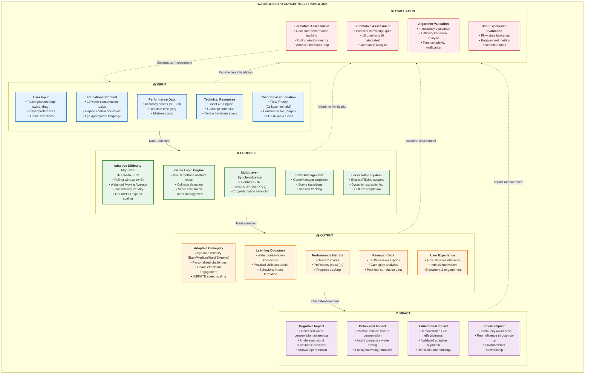
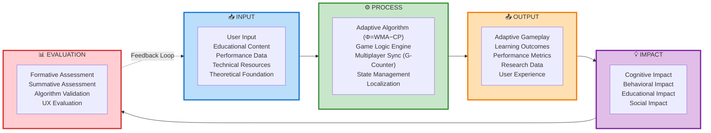
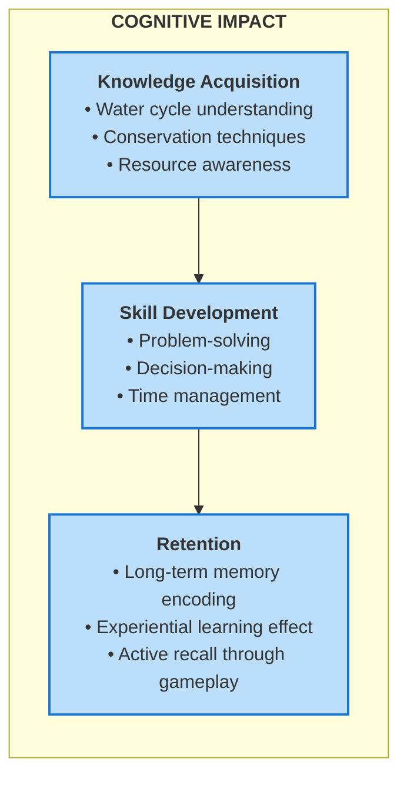
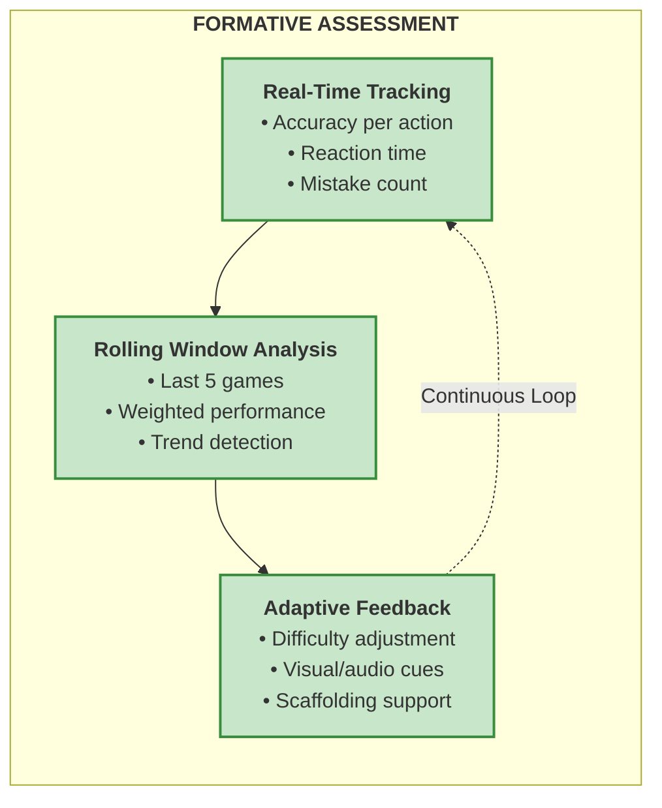

# IPO CONCEPTUAL FRAMEWORK
## WaterWise: Adaptive Educational Game for Water Conservation

**Document Version:** 1.0  
**Date:** December 2024  
**Research Type:** Thesis 1 - Theoretical Framework  
**Target Users:** Children Ages 6-12  

---

## TABLE OF CONTENTS

1. [Conceptual Framework Overview](#1-conceptual-framework-overview)
2. [IPO Model Diagram](#2-ipo-model-diagram)
3. [INPUT Components](#3-input-components)
4. [PROCESS Components](#4-process-components)
5. [OUTPUT Components](#5-output-components)
6. [IMPACT Assessment](#6-impact-assessment)
7. [EVALUATION Framework](#7-evaluation-framework)
8. [Detailed Component Tables](#8-detailed-component-tables)
9. [Gemini/Lucidchart Prompt](#9-geminilucidchart-prompt)

---

## 1. CONCEPTUAL FRAMEWORK OVERVIEW

The WaterWise IPO Conceptual Framework presents a comprehensive model that illustrates how the adaptive educational game transforms various inputs into meaningful outputs, creates measurable impact on water conservation awareness, and provides mechanisms for continuous evaluation and improvement.

### 1.1 Framework Structure

```
┌─────────────────────────────────────────────────────────────────────────────────┐
│                    WATERWISE IPO CONCEPTUAL FRAMEWORK                          │
├─────────────────────────────────────────────────────────────────────────────────┤
│                                                                                 │
│   ┌─────────┐     ┌──────────────┐     ┌─────────┐     ┌─────────┐            │
│   │  INPUT  │ ──► │   PROCESS    │ ──► │ OUTPUT  │ ──► │ IMPACT  │            │
│   └─────────┘     └──────────────┘     └─────────┘     └─────────┘            │
│        │                                                     │                  │
│        │                 ┌────────────┐                     │                  │
│        └────────────────►│ EVALUATION │◄────────────────────┘                  │
│                          └────────────┘                                         │
│                               │                                                 │
│                               ▼                                                 │
│                        (Feedback Loop)                                          │
│                                                                                 │
└─────────────────────────────────────────────────────────────────────────────────┘
```

---

## 2. IPO MODEL DIAGRAM

### 2.1 Complete IPO Conceptual Framework (Mermaid)



### 2.2 Simplified IPO Linear Flow



---

## 3. INPUT COMPONENTS

### 3.1 User Input

| Component | Description | Data Type | Source |
|-----------|-------------|-----------|--------|
| Touch Gestures | Tap, swipe, drag interactions | Vector2, InputEvent | Touchscreen/Mouse |
| Player Preferences | Language, volume, accessibility | Dictionary | Settings UI |
| Game Selection | Mini-game choice, mode selection | String, Enum | Main Menu |
| Multiplayer Actions | Host/Join, peer interactions | Network Packets | ENet UDP |

### 3.2 Educational Content

| Component | Description | Quantity | Format |
|-----------|-------------|----------|--------|
| Water Conservation Topics | Filipino context scenarios | 19 topics | Mini-games |
| Learning Objectives | Age-appropriate goals | Per game | Instructional text |
| Visual Assets | Characters, environments | Multiple | Sprites, 3D models |
| Audio Content | SFX, background music, voice | Multiple | Audio files |

### 3.3 Performance Data

| Component | Description | Range/Type | Collection Point |
|-----------|-------------|------------|------------------|
| Accuracy | Correct actions / total actions | 0.0 - 1.0 (float) | End of mini-game |
| Reaction Time | Time to complete actions | Milliseconds (int) | Per action |
| Mistake Count | Number of errors | Integer | During gameplay |
| Game Duration | Total play time | Seconds (float) | Session tracking |

### 3.4 Technical Resources

| Resource | Specification | Purpose |
|----------|---------------|---------|
| Godot Engine | Version 4.5 | Game development platform |
| GDScript | Native scripting | Game logic implementation |
| ENet Protocol | UDP, Port 7777 | Multiplayer networking |
| ConfigFile | Local storage | Data persistence |

### 3.5 Theoretical Foundation

| Theory | Author(s) | Application in WaterWise |
|--------|-----------|--------------------------|
| Flow Theory | Csikszentmihalyi (1990) | Adaptive difficulty maintains optimal challenge |
| Constructivism | Piaget (1973) | Experiential learning through simulation |
| Self-Determination Theory | Ryan & Deci (2000) | Intrinsic motivation via autonomy |
| Zone of Proximal Development | Vygotsky (1978) | Difficulty within learner capability |
| Game-Based Learning | Gee (2007) | Educational content through gameplay |

---

## 4. PROCESS COMPONENTS

### 4.1 Adaptive Difficulty Algorithm (Φ = WMA − CP)

```
┌─────────────────────────────────────────────────────────────────────┐
│                    ALGORITHM: Φ = WMA − CP                          │
├─────────────────────────────────────────────────────────────────────┤
│                                                                     │
│  STEP 1: Rolling Window (FIFO Queue, n = 5)                        │
│  ─────────────────────────────────────────                         │
│  performance_window = [{acc, time, mistakes}, ...]                 │
│  IF window.size() > 5: window.pop_front()                          │
│  window.append(new_performance)                                     │
│                                                                     │
│  STEP 2: Weighted Moving Average (WMA)                             │
│  ─────────────────────────────────────                             │
│  weights = [1, 2, 3, 4, 5]  // Linear, recent = higher             │
│  WMA = Σ(wᵢ × accᵢ) / Σ(wᵢ)                                        │
│      = (1×acc₁ + 2×acc₂ + 3×acc₃ + 4×acc₄ + 5×acc₅) / 15          │
│                                                                     │
│  STEP 3: Standard Deviation (σ)                                    │
│  ──────────────────────────────                                    │
│  μ = Σ(timeᵢ) / n                                                  │
│  σ = √(Σ(timeᵢ − μ)² / n)                                          │
│                                                                     │
│  STEP 4: Consistency Penalty (CP)                                  │
│  ─────────────────────────────                                     │
│  CP = min(σ / 5000, 0.2)                                           │
│  Range: [0.0, 0.2]                                                 │
│                                                                     │
│  STEP 5: Proficiency Index (Φ)                                     │
│  ─────────────────────────────                                     │
│  Φ = WMA − CP                                                       │
│  Range: [-0.2, 1.0]                                                │
│                                                                     │
│  STEP 6: Rule-Based Decision Tree                                  │
│  ────────────────────────────────                                  │
│  IF Φ < 0.5:      difficulty = "Easy"    (Struggling/Erratic)     │
│  ELIF Φ > 0.85:   difficulty = "Hard"    (Mastery)                │
│  ELSE:            difficulty = "Medium"  (Flow State)             │
│                                                                     │
└─────────────────────────────────────────────────────────────────────┘
```

### 4.2 Game Logic Engine

| Component | Responsibility | Implementation |
|-----------|----------------|----------------|
| MiniGameBase | Abstract base class | `scripts/MiniGameBase.gd` |
| Collision Detection | Input-object interaction | Godot Physics2D |
| Score Calculation | Points with difficulty multiplier | `(accuracy × 100) × diff_mult` |
| Timer Management | Countdown, time pressure | Godot Timer node |

### 4.3 Multiplayer Synchronization (G-Counter CRDT)

```
┌─────────────────────────────────────────────────────────────────────┐
│              G-COUNTER CRDT OPERATIONS                              │
├─────────────────────────────────────────────────────────────────────┤
│                                                                     │
│  DATA STRUCTURE:                                                    │
│  g_counter = {peer_id: score, ...}                                  │
│                                                                     │
│  OPERATIONS:                                                        │
│  ┌─────────────────────────────────────────────────────────────┐   │
│  │ increment(peer_id, points):                                  │   │
│  │   g_counter[peer_id] += points                               │   │
│  └─────────────────────────────────────────────────────────────┘   │
│  ┌─────────────────────────────────────────────────────────────┐   │
│  │ query():                                                     │   │
│  │   return Σ g_counter[peer_id] for all peers                  │   │
│  └─────────────────────────────────────────────────────────────┘   │
│  ┌─────────────────────────────────────────────────────────────┐   │
│  │ merge(local, remote):                                        │   │
│  │   for peer in remote:                                        │   │
│  │     g_counter[peer] = max(local[peer], remote[peer])         │   │
│  └─────────────────────────────────────────────────────────────┘   │
│                                                                     │
│  PROPERTIES:                                                        │
│  ✓ Commutative (order doesn't matter)                              │
│  ✓ Idempotent (duplicates are safe)                                │
│  ✓ Monotonic (only increments)                                     │
│  ✓ Eventually Consistent                                           │
│                                                                     │
└─────────────────────────────────────────────────────────────────────┘
```

### 4.4 State Management

| State | Description | Transitions |
|-------|-------------|-------------|
| MAIN_MENU | Navigation hub | → LOADING, SETTINGS, MULTIPLAYER_LOBBY |
| LOADING | Scene preparation | → INSTRUCTIONS |
| INSTRUCTIONS | Per-game tutorial | → PLAYING_MINIGAME |
| PLAYING_MINIGAME | Active gameplay | → PAUSED, MINIGAME_RESULTS |
| PAUSED | Suspended state | → PLAYING_MINIGAME, MAIN_MENU |
| MINIGAME_RESULTS | Post-game tally | → LOADING, FINAL_RESULTS |
| FINAL_RESULTS | Session summary | → MAIN_MENU |

### 4.5 Localization System

| Feature | Description | Implementation |
|---------|-------------|----------------|
| Languages | English, Filipino | Dictionary lookup |
| Dynamic Switching | Runtime language change | `Localization.set_language()` |
| Cultural Adaptation | Filipino context scenarios | Localized content |

---

## 5. OUTPUT COMPONENTS

### 5.1 Adaptive Gameplay

| Difficulty | Speed Multiplier | Time Limit | Hints | Chaos Effects |
|------------|------------------|------------|-------|---------------|
| **Easy** (Φ < 0.5) | 0.7× | 20 seconds | 3 | None |
| **Medium** (0.5 ≤ Φ ≤ 0.85) | 1.0× | 15 seconds | 2 | Mild screen shake |
| **Hard** (Φ > 0.85) | 1.5×+ **(UNCAPPED!)** | 10 seconds | 1 | Shake, mud, fly, reverse |
| **Extreme** (mult > 2.0) | 2.0×+ **(INFINITE!)** | 10 seconds | 1 | All chaos effects |

### 5.2 Learning Outcomes

| Category | Description | Measurement |
|----------|-------------|-------------|
| Conceptual | Understanding water conservation principles | Post-test questions |
| Application | Practical water-saving techniques | Gameplay accuracy |
| Retention | Long-term knowledge recall | Follow-up assessment |
| Behavioral | Intent to practice conservation | Behavioral category questions |

### 5.3 Performance Metrics

| Metric | Description | Formula/Calculation |
|--------|-------------|---------------------|
| Session Score | Cumulative points | Σ(accuracy × 100 × difficulty_mult) |
| Proficiency Index (Φ) | Skill level indicator | WMA − CP |
| Learning Velocity | Improvement rate | (second_half_avg − first_half_avg) |
| Consistency | Timing stability | 1 − (σ / 5000) |

### 5.4 Research Data

| Data Type | Format | Purpose |
|-----------|--------|---------|
| Session Export | JSON | Complete session analytics |
| Performance History | Array<Dictionary> | Trend analysis |
| Difficulty Timeline | Array<Dictionary> | Algorithm validation |
| Post-test Answers | Array<Dictionary> | Correlation analysis |

### 5.5 User Experience

| Aspect | Indicator | Target |
|--------|-----------|--------|
| Flow State | Challenge-skill balance | 0.5 ≤ Φ ≤ 0.85 (Medium) |
| Engagement | Session duration, return rate | Extended play sessions |
| Enjoyment | Subjective feedback | Positive experience |
| Motivation | Intrinsic vs. extrinsic | Autonomous motivation |

---

## 6. IMPACT ASSESSMENT

### 6.1 Cognitive Impact



| Cognitive Domain | Description | Expected Outcome |
|------------------|-------------|------------------|
| Knowledge | Recall of conservation facts | Can list 5+ water-saving methods |
| Comprehension | Understanding principles | Explains why conservation matters |
| Application | Using knowledge practically | Applies techniques at home |
| Analysis | Identifying water waste | Recognizes inefficient practices |

### 6.2 Behavioral Impact

| Behavior Change | Description | Measurement |
|-----------------|-------------|-------------|
| Attitude Shift | Positive view toward conservation | Pre/post attitude survey |
| Intent Formation | Plan to practice water saving | Behavioral questions in post-test |
| Knowledge Transfer | Teaching family members | Self-reported survey |
| Habit Development | Regular conservation practices | Follow-up survey (if empirical) |

### 6.3 Educational Impact

| Impact Area | Description | Contribution |
|-------------|-------------|--------------|
| GBL Validation | Demonstrates game-based learning effectiveness | Academic evidence |
| Algorithm Innovation | Novel Φ = WMA − CP approach | Adaptive learning contribution |
| Methodology | Replicable research framework | Future study template |
| Philippine Context | Localized educational content | Cultural relevance |

### 6.4 Social Impact

| Impact Area | Description | Scope |
|-------------|-------------|-------|
| Family Influence | Children teach parents | Household level |
| Peer Learning | Multiplayer co-op spreads awareness | Community level |
| Environmental | Collective water conservation | Societal level |
| Educational | Model for other subjects | Institutional level |

---

## 7. EVALUATION FRAMEWORK

### 7.1 Formative Assessment (During Gameplay)



| Metric | Collection Point | Frequency | Use |
|--------|------------------|-----------|-----|
| Accuracy | End of each action | Per action | Immediate feedback |
| Reaction Time | Action completion | Per action | Consistency analysis |
| Mistakes | Error occurrence | Real-time | Support triggers |
| Session Progress | Mini-game completion | Per game | Difficulty decision |

### 7.2 Summative Assessment (Post-Test)

| Category | Questions | Purpose | Example Topic |
|----------|-----------|---------|---------------|
| Conceptual | 5 | Test understanding | Why save water? |
| Application | 5 | Test practical skills | How to water plants? |
| Retention | 3 | Test memory | What happened in game? |
| Behavioral | 2 | Test intent | What will you do at home? |

### 7.3 Algorithm Validation

| Validation Aspect | Method | Success Criteria |
|-------------------|--------|------------------|
| Φ Accuracy | Correlation with actual skill | r > 0.7 |
| Difficulty Transitions | Transition appropriateness | < 10% over-adjustment |
| Time Complexity | Big-O analysis | O(n) where n = window_size |
| Convergence (G-Counter) | Sync latency measurement | < 100ms average |

### 7.4 Correlation Analysis

```
┌─────────────────────────────────────────────────────────────────────┐
│                    CORRELATION ANALYSIS                             │
├─────────────────────────────────────────────────────────────────────┤
│                                                                     │
│  FORMULA: Pearson Correlation Coefficient (r)                      │
│  ─────────────────────────────────────────────                     │
│  r = [n(Σxy) − (Σx)(Σy)] / √([nΣx² − (Σx)²][nΣy² − (Σy)²])        │
│                                                                     │
│  VARIABLES:                                                         │
│  • x = Gameplay Performance Score (0-100%)                          │
│  • y = Post-Test Knowledge Score (0-100%)                           │
│                                                                     │
│  INTERPRETATION:                                                    │
│  ┌──────────────────────────────────────────────────────────────┐  │
│  │ |r| ≥ 0.70  →  STRONG correlation (algorithm validated)     │  │
│  │ |r| ≥ 0.40  →  MODERATE correlation (partial validation)    │  │
│  │ |r| ≥ 0.20  →  WEAK correlation (needs refinement)          │  │
│  │ |r| < 0.20  →  NO correlation (algorithm not effective)     │  │
│  └──────────────────────────────────────────────────────────────┘  │
│                                                                     │
│  EXPECTED OUTCOME:                                                  │
│  High gameplay performance should correlate with high post-test    │
│  scores, validating that the adaptive algorithm facilitated        │
│  learning transfer.                                                 │
│                                                                     │
└─────────────────────────────────────────────────────────────────────┘
```

---

## 8. DETAILED COMPONENT TABLES

### 8.1 Complete IPO Matrix

| Stage | Component | Description | Data Flow |
|-------|-----------|-------------|-----------|
| **INPUT** | User Input | Touch events, selections | Player → UI Controller |
| | Educational Content | 19 mini-game topics | Content Database → Game Logic |
| | Performance Data | Accuracy, time, mistakes | MiniGame → AdaptiveDifficulty |
| | Technical Resources | Engine, scripts, assets | Development → Runtime |
| | Theoretical Foundation | Learning theories | Research → Design |
| **PROCESS** | Adaptive Algorithm | Φ = WMA − CP calculation | AdaptiveDifficulty autoload |
| | Game Logic | Collision, scoring, timer | MiniGameBase class |
| | Multiplayer Sync | G-Counter CRDT merge | NetworkManager / GameManager |
| | State Management | Scene transitions, session | GameManager autoload |
| | Localization | EN/Filipino translation | Localization autoload |
| **OUTPUT** | Adaptive Gameplay | Dynamic difficulty settings | AdaptiveDifficulty → MiniGame |
| | Learning Outcomes | Knowledge, skills, behavior | Gameplay → Learner |
| | Performance Metrics | Scores, Φ, progress | System → User/Research |
| | Research Data | JSON exports, analytics | ConfigFile → Researcher |
| | User Experience | Flow, motivation, enjoyment | System → User |
| **IMPACT** | Cognitive | Knowledge acquisition | Learning outcomes |
| | Behavioral | Attitude and intent change | Long-term behavior |
| | Educational | GBL effectiveness validation | Academic contribution |
| | Social | Community awareness | Societal benefit |
| **EVALUATION** | Formative | Real-time performance tracking | Continuous during gameplay |
| | Summative | Post-test knowledge assessment | End of session |
| | Algorithm Validation | Φ accuracy, complexity | Research analysis |
| | UX Evaluation | Flow, engagement metrics | User feedback |

### 8.2 Input-to-Output Transformation Table

| Input | Process Applied | Output Generated |
|-------|-----------------|------------------|
| Touch gesture | Collision detection | Score increment/decrement |
| Player accuracy | WMA calculation | Weighted performance metric |
| Reaction times | Standard deviation | Consistency penalty |
| Performance window | Φ = WMA − CP | Proficiency Index |
| Proficiency Index | Decision tree | Difficulty setting |
| Difficulty setting | Parameter application | Adaptive gameplay |
| Gameplay experience | Learning transfer | Knowledge/skill acquisition |
| Knowledge gained | Behavioral formation | Conservation intent |

### 8.3 Impact Measurement Table

| Impact Type | Short-Term Indicator | Long-Term Indicator | Measurement Method |
|-------------|----------------------|---------------------|-------------------|
| Cognitive | Post-test score | Knowledge retention | Quiz, follow-up test |
| Behavioral | Intent statements | Actual behavior change | Survey, observation |
| Educational | Algorithm validation | Method replication | Correlation analysis |
| Social | Peer influence | Community awareness | Survey, interviews |

---

## 9. GEMINI/LUCIDCHART PROMPT

### 9.1 Comprehensive Prompt for IPO Conceptual Framework Diagram

```
Create a formal IPO Conceptual Framework diagram for an educational game called "WaterWise" with the following specifications:

DIAGRAM TITLE: "WaterWise IPO Conceptual Framework - Adaptive Educational Game for Water Conservation"

LAYOUT: Horizontal flow from left to right with 5 main columns:
1. INPUT (Blue #2196F3)
2. PROCESS (Green #4CAF50)
3. OUTPUT (Orange #FF9800)
4. IMPACT (Purple #9C27B0)
5. EVALUATION (Red #F44336)

═══════════════════════════════════════════════════════════════════
COLUMN 1: INPUT (📥)
═══════════════════════════════════════════════════════════════════
Create 5 rounded rectangles with the following content:

BOX I1 - "User Input"
• Touch gestures (tap, swipe, drag)
• Player preferences
• Game selections
• Multiplayer actions

BOX I2 - "Educational Content"
• 19 water conservation topics
• Filipino context scenarios
• Age-appropriate language (6-12 years)
• Visual and audio assets

BOX I3 - "Performance Data"
• Accuracy scores (0.0-1.0)
• Reaction time (milliseconds)
• Mistake count (integer)
• Session duration

BOX I4 - "Technical Resources"
• Godot Engine 4.5
• GDScript codebase
• ENet networking (UDP:7777)
• Device hardware

BOX I5 - "Theoretical Foundation"
• Flow Theory (Csikszentmihalyi)
• Constructivism (Piaget)
• Self-Determination Theory
• Zone of Proximal Development

═══════════════════════════════════════════════════════════════════
COLUMN 2: PROCESS (⚙️)
═══════════════════════════════════════════════════════════════════
Create 5 rounded rectangles with the following content:

BOX P1 - "Adaptive Difficulty Algorithm"
Formula: Φ = WMA − CP
• Rolling window (n = 5 games)
• Weighted Moving Average
• Consistency Penalty
• Rule-based decision tree

BOX P2 - "Game Logic Engine"
• MiniGameBase abstract class
• Collision detection
• Score calculation
• Timer management

BOX P3 - "Multiplayer Synchronization"
Algorithm: G-Counter CRDT
• ENet UDP (Port 7777)
• CoopAdaptation balancing
• Eventual consistency

BOX P4 - "State Management"
• GameManager singleton
• Scene transitions
• Session tracking
• Save/Load persistence

BOX P5 - "Localization System"
• English/Filipino support
• Dynamic text switching
• Cultural adaptation

═══════════════════════════════════════════════════════════════════
COLUMN 3: OUTPUT (📤)
═══════════════════════════════════════════════════════════════════
Create 5 rounded rectangles with the following content:

BOX O1 - "Adaptive Gameplay"
• Dynamic difficulty (Easy/Medium/Hard)
• Personalized challenges
• Chaos effects for engagement
• Scaffolding support

BOX O2 - "Learning Outcomes"
• Water conservation knowledge
• Practical skills acquisition
• Behavioral intent formation
• Knowledge retention

BOX O3 - "Performance Metrics"
• Session scores
• Proficiency Index (Φ)
• Progress tracking
• Achievement unlocks

BOX O4 - "Research Data"
• JSON session exports
• Gameplay analytics
• Difficulty transition logs
• Post-test correlation data

BOX O5 - "User Experience"
• Flow state maintenance
• Intrinsic motivation
• Enjoyment & engagement
• Reduced frustration

═══════════════════════════════════════════════════════════════════
COLUMN 4: IMPACT (💡)
═══════════════════════════════════════════════════════════════════
Create 4 rounded rectangles with the following content:

BOX IM1 - "Cognitive Impact"
• Increased water conservation awareness
• Understanding of sustainable practices
• Long-term knowledge retention
• Critical thinking development

BOX IM2 - "Behavioral Impact"
• Positive attitude toward conservation
• Intent to practice water saving
• Family knowledge transfer
• Habit formation potential

BOX IM3 - "Educational Impact"
• Demonstrated GBL effectiveness
• Validated adaptive algorithm
• Replicable methodology
• Contribution to Philippine education

BOX IM4 - "Social Impact"
• Community awareness
• Peer influence through co-op mode
• Environmental stewardship
• Intergenerational learning

═══════════════════════════════════════════════════════════════════
COLUMN 5: EVALUATION (📊)
═══════════════════════════════════════════════════════════════════
Create 4 rounded rectangles with the following content:

BOX E1 - "Formative Assessment"
• Real-time performance tracking
• Rolling window metrics
• Adaptive feedback loop
• Immediate error correction

BOX E2 - "Summative Assessment"
• Post-test knowledge quiz (15 questions)
• Category breakdown (5 types)
• Correlation analysis (r coefficient)
• Learning transfer verification

BOX E3 - "Algorithm Validation"
• Φ accuracy evaluation
• Difficulty transition analysis
• Time complexity verification O(n)
• G-Counter convergence testing

BOX E4 - "User Experience Evaluation"
• Flow state indicators
• Engagement metrics
• Retention rate tracking
• Satisfaction assessment

═══════════════════════════════════════════════════════════════════
ARROWS AND CONNECTIONS
═══════════════════════════════════════════════════════════════════

MAIN FLOW ARROWS (Solid, thick):
1. INPUT → PROCESS (labeled "Data Collection")
2. PROCESS → OUTPUT (labeled "Transformation")
3. OUTPUT → IMPACT (labeled "Effect Measurement")

EVALUATION ARROWS (Dashed):
4. INPUT ⟵ - - - EVALUATION (labeled "Requirements Validation")
5. PROCESS ⟵ - - - EVALUATION (labeled "Algorithm Verification")
6. OUTPUT ⟵ - - - EVALUATION (labeled "Outcome Assessment")
7. IMPACT → EVALUATION (labeled "Impact Measurement")
8. EVALUATION - - - → INPUT (labeled "Continuous Improvement" / "Feedback Loop")

═══════════════════════════════════════════════════════════════════
STYLING REQUIREMENTS
═══════════════════════════════════════════════════════════════════

COLORS:
• INPUT column: Blue (#2196F3 background, #1565C0 border)
• PROCESS column: Green (#4CAF50 background, #2E7D32 border)
• OUTPUT column: Orange (#FF9800 background, #EF6C00 border)
• IMPACT column: Purple (#9C27B0 background, #7B1FA2 border)
• EVALUATION column: Red (#F44336 background, #C62828 border)

FONTS:
• Title: Bold, 24pt
• Box headers: Bold, 14pt
• Box content: Regular, 10pt
• Arrow labels: Italic, 9pt

BOX STYLING:
• Rounded corners (10px radius)
• Drop shadow for depth
• White text on colored background
• Icons (📥, ⚙️, 📤, 💡, 📊) next to column headers

LAYOUT:
• All boxes in same column should be vertically aligned
• Equal spacing between boxes
• Arrows should not overlap
• Legend at bottom explaining color coding
• Title banner at top with subtitle

═══════════════════════════════════════════════════════════════════
LEGEND (Bottom of diagram)
═══════════════════════════════════════════════════════════════════

Create a horizontal legend with:
• Blue square: INPUT - Data and resources entering the system
• Green square: PROCESS - Transformation algorithms and logic
• Orange square: OUTPUT - Products and deliverables
• Purple square: IMPACT - Effects and outcomes
• Red square: EVALUATION - Assessment and validation
• Solid arrow: Main data flow direction
• Dashed arrow: Feedback loop for continuous improvement

═══════════════════════════════════════════════════════════════════
ADDITIONAL NOTES
═══════════════════════════════════════════════════════════════════

• The diagram should clearly show the cyclical nature of evaluation
• Emphasize that evaluation connects ALL stages, not just the end
• The feedback loop from EVALUATION back to INPUT represents the iterative improvement process
• All text should be readable at 100% zoom
• Export in high resolution (300 DPI) for thesis document inclusion
```

---

## APPENDIX A: FORMULAS REFERENCE

### A.1 Weighted Proficiency Index

$$\Phi = WMA - CP$$

### A.2 Weighted Moving Average

$$WMA = \frac{\sum_{i=1}^{n} w_i \cdot accuracy_i}{\sum_{i=1}^{n} w_i} = \frac{1 \cdot acc_1 + 2 \cdot acc_2 + 3 \cdot acc_3 + 4 \cdot acc_4 + 5 \cdot acc_5}{1 + 2 + 3 + 4 + 5}$$

### A.3 Consistency Penalty

$$CP = \min\left(\frac{\sigma}{5000}, 0.2\right)$$

### A.4 Standard Deviation

$$\sigma = \sqrt{\frac{\sum_{i=1}^{n}(t_i - \mu)^2}{n}}$$

### A.5 G-Counter Global Score

$$GlobalScore = \sum_{i=1}^{n} g\_counter[peer_i]$$

### A.6 Pearson Correlation Coefficient

$$r = \frac{n(\sum xy) - (\sum x)(\sum y)}{\sqrt{[n\sum x^2 - (\sum x)^2][n\sum y^2 - (\sum y)^2]}}$$

---

## APPENDIX B: ALGORITHM PARAMETERS

| Parameter | Value | Description |
|-----------|-------|-------------|
| Window Size (n) | 5 | Number of games in rolling window |
| Weights | [1, 2, 3, 4, 5] | Linear weights, sum = 15 |
| CP Maximum | 0.2 | Maximum consistency penalty |
| CP Divisor | 5000 | Normalization factor for σ |
| Easy Threshold | Φ < 0.5 | Below this = struggling |
| Hard Threshold | Φ > 0.85 | Above this = mastery |
| Adaptation Frequency | 2 games | How often to recalculate |

---

**Document End**

*IPO Conceptual Framework for WaterWise Educational Game*  
*Thesis 1 - Theoretical Research Documentation*
