# WATERWISE EDUCATIONAL GAME - TECHNICAL DIAGRAMS
## Formal Documentation for Thesis Research

**Document Version:** 1.0  
**Date:** December 2024  
**System:** WaterWise - Adaptive Educational Game for Water Conservation  
**Engine:** Godot 4.x (GDScript)  

---

## TABLE OF CONTENTS

1. [System Architecture Diagram](#1-system-architecture-diagram)
2. [Adaptive Difficulty Algorithm Flowchart](#2-adaptive-difficulty-algorithm-flowchart)
3. [Data Flow Diagram (DFD)](#3-data-flow-diagram)
4. [Use Case Diagram](#4-use-case-diagram)
5. [Class Diagram](#5-class-diagram)
6. [Entity-Relationship Diagram](#6-entity-relationship-diagram)
7. [Sequence Diagram - Game Session](#7-sequence-diagram---game-session)
8. [State Machine Diagram](#8-state-machine-diagram)
9. [IPO Chart](#9-ipo-chart---input-process-output)
10. [Network Architecture (Multiplayer)](#10-network-architecture-diagram)

---

## 1. SYSTEM ARCHITECTURE DIAGRAM

### 1.1 Four-Module System Architecture

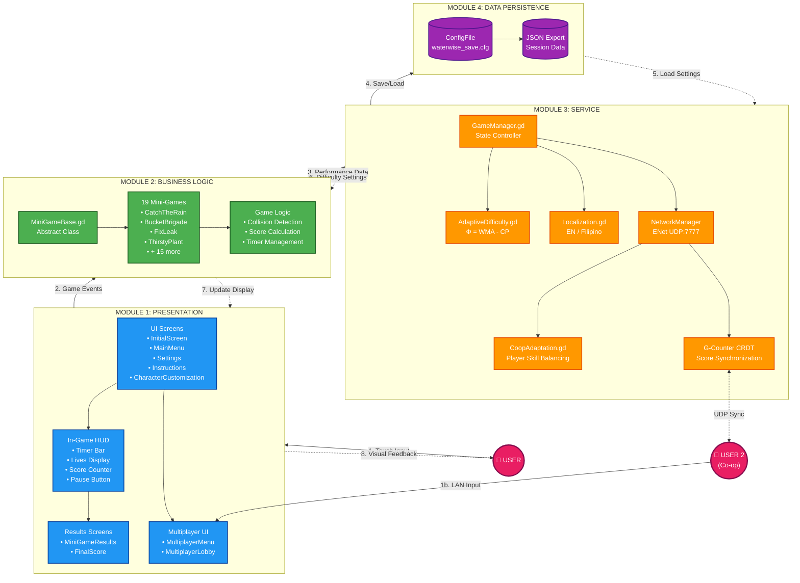

### 1.2 Component Interaction Diagram

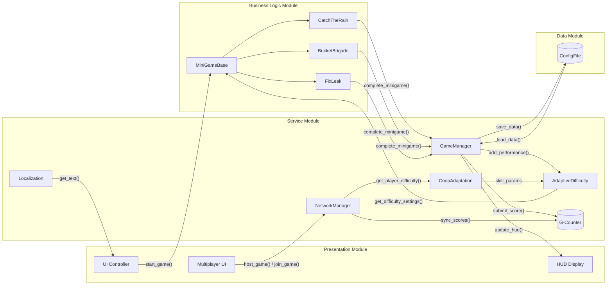

### 1.3 Mini-Game Flow Logic

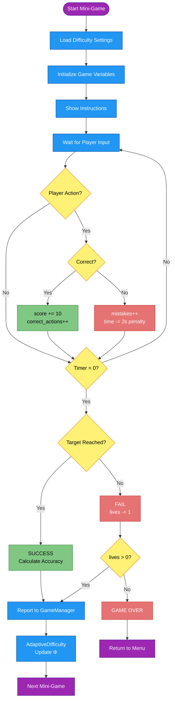

### 1.4 Multiplayer Architecture

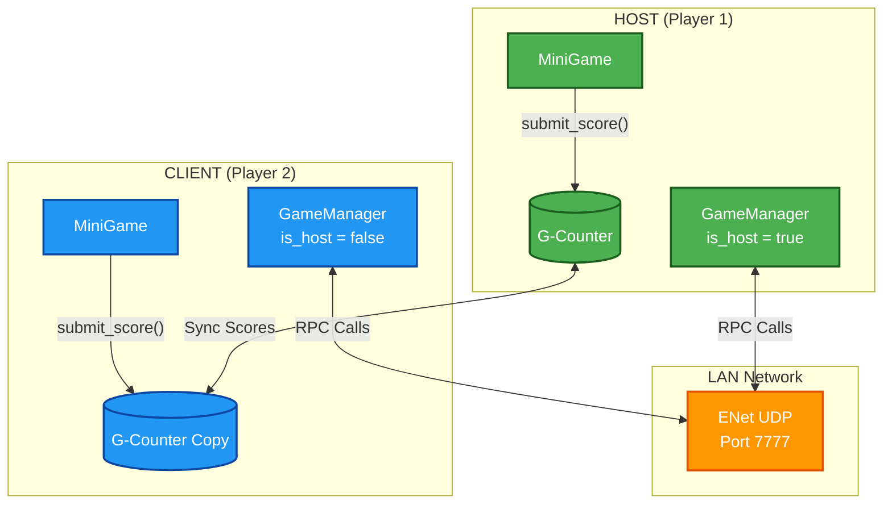

### 1.5 System Architecture Table

| Module | Components | Responsibility |
|--------|------------|----------------|
| **Module 1: Presentation** | UI Screens, HUD, Results, Multiplayer UI | User interface rendering, input capture, visual feedback, lobby management |
| **Module 2: Business Logic** | MiniGameBase, 19 Mini-Games | Game mechanics, collision detection, scoring logic |
| **Module 3: Service** | GameManager, AdaptiveDifficulty, Localization, NetworkManager, CoopAdaptation, G-Counter | State management, difficulty adaptation, translations, multiplayer sync, skill balancing |
| **Module 4: Data Persistence** | ConfigFile, JSON Export | Save/load progress, session data export |

---

## 2. ADAPTIVE DIFFICULTY ALGORITHM FLOWCHART

### 2.1 Weighted Proficiency Index (Φ) Algorithm

```mermaid
flowchart TD
    START([🎮 GAME COMPLETED])
    
    subgraph INPUT["<b>INPUT: Performance Data</b>"]
        I1["accuracy: float (0.0 - 1.0)"]
        I2["reaction_time: int (milliseconds)"]
        I3["mistakes: int"]
        I4["game_name: String"]
    end
    
    subgraph WINDOW["<b>ROLLING WINDOW (FIFO Queue)</b>"]
        W1["performance_window: Array&lt;Dictionary&gt;[3]"]
        W2{"window.size() >= 3?"}
        W3["window.pop_front()<br/>(Remove oldest)"]
        W4["window.append(new_data)"]
    end
    
    subgraph WMA["<b>STEP 1: WEIGHTED MOVING AVERAGE</b>"]
        WMA1["<b>Formula:</b><br/>WMA = Σ(wᵢ × xᵢ) / Σ(wᵢ)"]
        WMA2["<b>Weights (Linear):</b><br/>Game 1: w=1<br/>Game 2: w=2<br/>Game 3: w=3"]
        WMA3["<b>Example:</b><br/>[0.6, 0.7, 0.95]<br/>WMA = (1×0.6 + 2×0.7 + 3×0.95) / 6<br/>= 4.85 / 6 = <b>0.808</b>"]
    end
    
    subgraph STD["<b>STEP 2: STANDARD DEVIATION (σ)</b>"]
        STD1["<b>Mean:</b> μ = Σ(timeᵢ) / N"]
        STD2["<b>Variance:</b> σ² = Σ(timeᵢ - μ)² / N"]
        STD3["<b>Std Dev:</b> σ = √(σ²)"]
        STD4["<b>Example:</b><br/>[5000, 6000, 5500]ms<br/>μ = 5500ms<br/>σ = 408.2ms"]
    end
    
    subgraph CP["<b>STEP 3: CONSISTENCY PENALTY</b>"]
        CP1["<b>Formula:</b><br/>CP = min(σ / 5000, 0.2)"]
        CP2["<b>Example:</b><br/>CP = min(408.2 / 5000, 0.2)<br/>= min(0.0816, 0.2)<br/>= <b>0.0816</b>"]
    end
    
    subgraph PHI["<b>STEP 4: PROFICIENCY INDEX (Φ)</b>"]
        PHI1["<b>Formula:</b><br/>Φ = WMA - CP"]
        PHI2["<b>Example:</b><br/>Φ = 0.808 - 0.0816<br/>= <b>0.726</b>"]
        PHI3["<b>Range:</b> -0.2 to 1.0"]
    end
    
    subgraph TREE["<b>STEP 5: RULE-BASED DECISION TREE</b>"]
        RULE1{"Φ < 0.5?"}
        RULE2{"Φ > 0.85?"}
        EASY["🟢 <b>EASY</b><br/>Player struggling<br/>or erratic timing"]
        MEDIUM["🟡 <b>MEDIUM</b><br/>Flow state<br/>Optimal learning"]
        HARD["🔴 <b>HARD</b><br/>Mastery +<br/>Consistency"]
    end
    
    subgraph OUTPUT["<b>OUTPUT: DIFFICULTY SETTINGS</b>"]
        OUT_E["<b>EASY:</b><br/>speed_multiplier: 0.7<br/>time_limit: 20s<br/>hints: 3<br/>chaos_effects: []"]
        OUT_M["<b>MEDIUM:</b><br/>speed_multiplier: 1.0<br/>time_limit: 15s<br/>hints: 2<br/>chaos_effects: [shake_mild]"]
        OUT_H["<b>HARD:</b><br/>speed_multiplier: 1.5<br/>time_limit: 10s<br/>hints: 1<br/>chaos_effects: [shake, mud, fly, reverse]"]
    end
    
    APPLY["Apply to Next Mini-Game"]
    
    %% Flow
    START --> INPUT
    INPUT --> W1
    W1 --> W2
    W2 -->|Yes| W3
    W3 --> W4
    W2 -->|No| W4
    W4 --> WMA1
    WMA1 --> WMA2
    WMA2 --> WMA3
    WMA3 --> STD1
    STD1 --> STD2
    STD2 --> STD3
    STD3 --> STD4
    STD4 --> CP1
    CP1 --> CP2
    CP2 --> PHI1
    PHI1 --> PHI2
    PHI2 --> PHI3
    PHI3 --> RULE1
    RULE1 -->|Yes| EASY
    RULE1 -->|No| RULE2
    RULE2 -->|Yes| HARD
    RULE2 -->|No| MEDIUM
    EASY --> OUT_E
    MEDIUM --> OUT_M
    HARD --> OUT_H
    OUT_E --> APPLY
    OUT_M --> APPLY
    OUT_H --> APPLY

    %% Styling
    classDef inputStyle fill:#E8F4FD,stroke:#3498DB,stroke-width:2px
    classDef processStyle fill:#E8F8E8,stroke:#27AE60,stroke-width:2px
    classDef decisionStyle fill:#FFF3E0,stroke:#E67E22,stroke-width:2px
    classDef outputStyle fill:#F3E5F5,stroke:#8E44AD,stroke-width:2px
    
    class I1,I2,I3,I4 inputStyle
    class W1,W2,W3,W4,WMA1,WMA2,WMA3,STD1,STD2,STD3,STD4,CP1,CP2,PHI1,PHI2,PHI3 processStyle
    class RULE1,RULE2 decisionStyle
    class EASY,MEDIUM,HARD,OUT_E,OUT_M,OUT_H,APPLY outputStyle
```

---

## 3. DATA FLOW DIAGRAM

### 3.1 Level 0 - Context Diagram

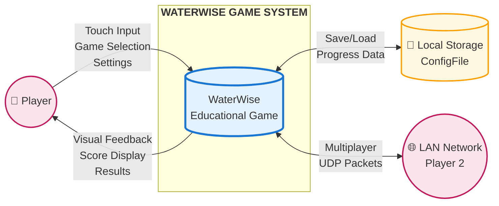

### 3.2 Level 1 - Detailed Data Flow

```mermaid
flowchart TB
    subgraph EXTERNAL["External Entities"]
        P1((👤 Player 1))
        P2((👤 Player 2))
    end
    
    subgraph PROCESS["Processes"]
        P1_1["1.0<br/>UI Controller<br/><i>Handle Input</i>"]
        P1_2["2.0<br/>Game Logic<br/><i>MiniGameBase</i>"]
        P1_3["3.0<br/>Adaptive Difficulty<br/><i>Φ Algorithm</i>"]
        P1_4["4.0<br/>Network Sync<br/><i>G-Counter CRDT</i>"]
        P1_5["5.0<br/>Data Manager<br/><i>Persistence</i>"]
        P1_6["6.0<br/>Coop Adaptation<br/><i>Skill Balancing</i>"]
        P1_7["7.0<br/>Localization<br/><i>EN/Filipino</i>"]
    end
    
    subgraph STORAGE["Data Stores"]
        D1[(D1: Performance Window<br/>Array&lt;Dictionary&gt;[3])]
        D2[(D2: Game State<br/>current_difficulty, lives)]
        D3[(D3: ConfigFile<br/>user://waterwise_save.cfg)]
        D4[(D4: G-Counter<br/>peer_id → score)]
        D5[(D5: Player Skills<br/>player1_skill, player2_skill)]
    end
    
    %% Player 1 flows
    P1 -->|"touch_event"| P1_1
    P1_1 -->|"game_selected"| P1_2
    P1_2 -->|"accuracy, time, mistakes"| P1_3
    P1_3 -->|"store metrics"| D1
    D1 -->|"window_data"| P1_3
    P1_3 -->|"difficulty_settings"| D2
    D2 -->|"current_difficulty"| P1_2
    P1_2 -->|"score_update"| P1_5
    P1_5 <-->|"save/load"| D3
    
    %% Multiplayer flows
    P1_2 -->|"points_scored"| P1_4
    P1_4 <-->|"UDP sync"| D4
    P2 -->|"remote_action"| P1_4
    P1_4 -->|"global_score"| P1_2
    
    %% Coop adaptation flows
    P1_4 -->|"player_performance"| P1_6
    P1_6 <-->|"skill_data"| D5
    P1_6 -->|"load_ratio"| P1_3
    
    %% Localization flows
    P1_7 -->|"translated_text"| P1_1
    D3 -->|"language_setting"| P1_7

    classDef entity fill:#FFEBEE,stroke:#D32F2F,stroke-width:2px
    classDef process fill:#E8F5E9,stroke:#388E3C,stroke-width:2px,rx:50
    classDef store fill:#FFF3E0,stroke:#F57C00,stroke-width:2px
    
    class P1,P2 entity
    class P1_1,P1_2,P1_3,P1_4,P1_5,P1_6,P1_7 process
    class D1,D2,D3,D4,D5 store
```

---

## 4. USE CASE DIAGRAM

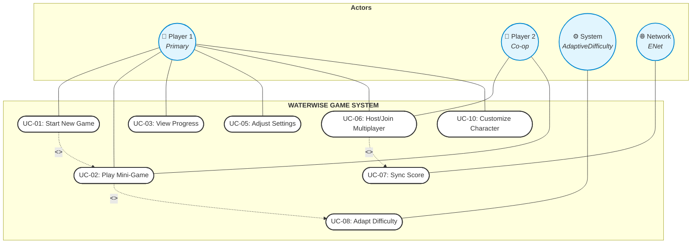

### 4.1 Use Case Descriptions

| ID | Use Case | Primary Actor | Description | Precondition | Postcondition |
|----|----------|---------------|-------------|--------------|---------------|
| UC-01 | Start New Game | Player 1 | Initialize game session | App launched | Session active |
| UC-02 | Play Mini-Game | Player 1/2 | Complete water conservation task | Game selected | Performance recorded |
| UC-03 | View Progress | Player 1 | Check scores, achievements | Session exists | Stats displayed |
| UC-05 | Adjust Settings | Player 1 | Language, volume, accessibility | In menu | Settings saved |
| UC-06 | Host/Join Multiplayer | Player 1/2 | LAN co-op connection | Network available | Peers connected |
| UC-07 | Sync Score | Network | G-Counter CRDT merge | Multiplayer active | Scores consistent |
| UC-08 | Adapt Difficulty | System | Calculate Φ, apply settings | ≥2 games completed | Difficulty adjusted |
| UC-10 | Customize Character | Player 1 | Avatar selection | In menu | Character saved |

---

## 5. CLASS DIAGRAM

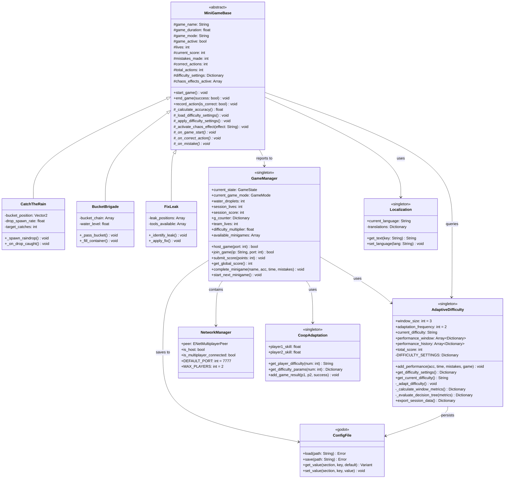

---

## 6. ENTITY-RELATIONSHIP DIAGRAM

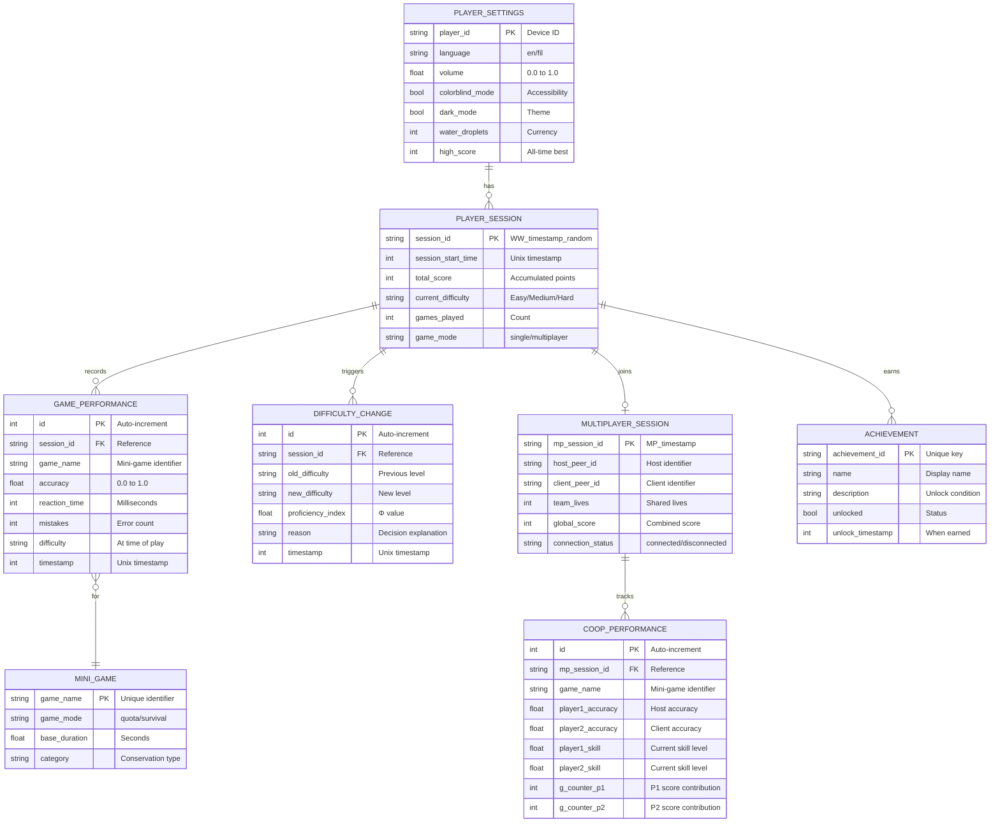

---

## 7. SEQUENCE DIAGRAM - GAME SESSION

### 7.1 Single Player Session

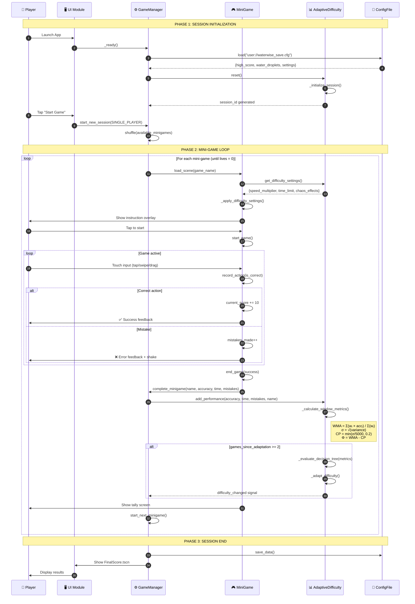

### 7.2 Multiplayer Session

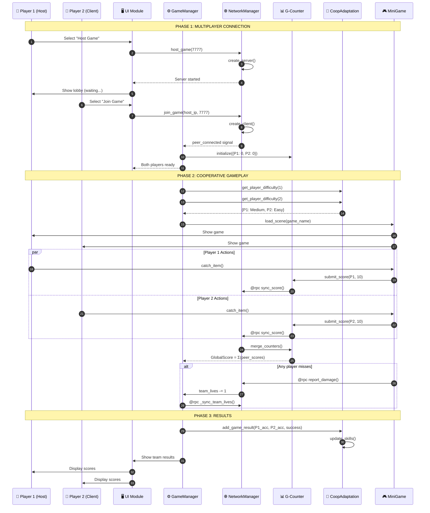

---

## 8. STATE MACHINE DIAGRAM

### 8.1 Single Player State Machine

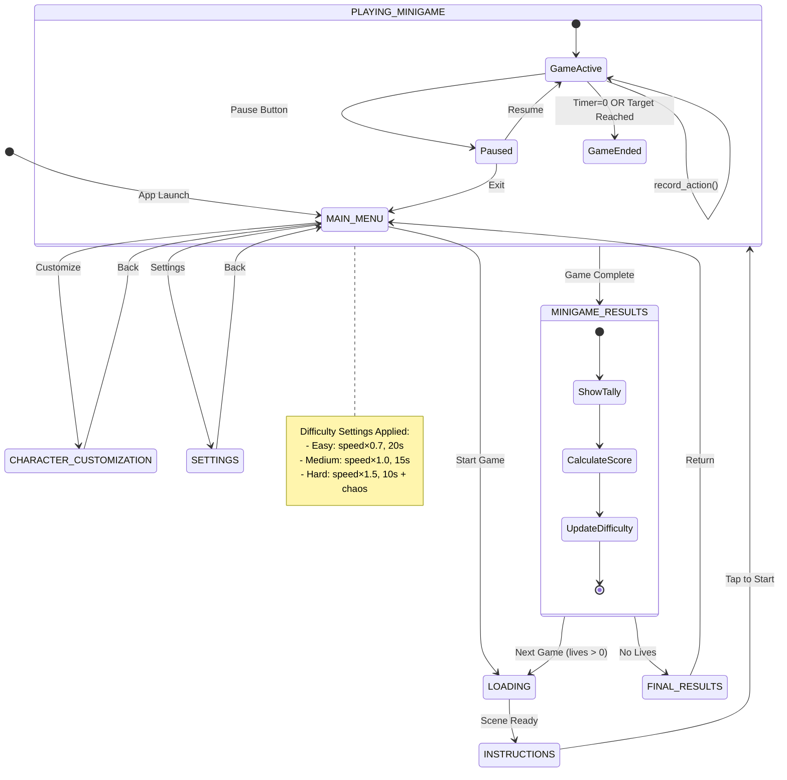

### 8.2 Multiplayer State Machine

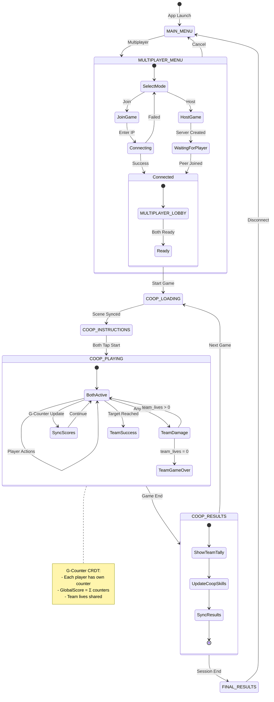

---

## 9. IPO CHART - INPUT PROCESS OUTPUT

### 9.1 Main IPO Table

```mermaid
flowchart LR
    subgraph INPUT["<b>INPUT</b>"]
        direction TB
        I1["🎮 Touch Events<br/>(tap, swipe, drag)"]
        I2["⚙️ Settings<br/>(language, volume)"]
        I3["📊 Performance Metrics<br/>(accuracy, time, mistakes)"]
        I4["🌐 Network Packets<br/>(peer actions, scores)"]
        I5["💾 Saved Data<br/>(ConfigFile)"]
    end
    
    subgraph PROCESS["<b>PROCESS</b>"]
        direction TB
        P1["1️⃣ UI Event Handler<br/>Parse input type"]
        P2["2️⃣ Game Logic<br/>Collision, scoring"]
        P3["3️⃣ Adaptive Algorithm<br/>Φ = WMA - CP"]
        P4["4️⃣ Network Sync<br/>G-Counter merge"]
        P5["5️⃣ Persistence<br/>Save/Load state"]
    end
    
    subgraph OUTPUT["<b>OUTPUT</b>"]
        direction TB
        O1["🖥️ Visual Feedback<br/>(animations, particles)"]
        O2["🔊 Audio Feedback<br/>(SFX, music)"]
        O3["📈 Score Updates<br/>(HUD display)"]
        O4["⚡ Difficulty Change<br/>(game parameters)"]
        O5["💾 Saved Progress<br/>(ConfigFile)"]
    end
    
    INPUT --> PROCESS
    PROCESS --> OUTPUT
```

### 9.2 Detailed IPO Per Module

| Module | Input | Process | Output |
|--------|-------|---------|--------|
| **MiniGameBase** | Touch position, delta time | Collision detection, timer update | Score increment, visual feedback |
| **AdaptiveDifficulty** | accuracy, reaction_time, mistakes | WMA calculation, σ computation, Φ derivation | difficulty_settings Dictionary |
| **GameManager** | Game completion data | State transition, score accumulation | Next scene, saved data |
| **NetworkManager** | Remote peer packets, RPC calls | ENet connection, message routing | Peer status, synced state |
| **G-Counter** | Player scores, peer counters | Increment local, merge remote | GlobalScore = Σ counters |
| **CoopAdaptation** | Player 1 & 2 accuracy | Skill calculation, load balancing | Per-player difficulty params |
| **Localization** | Language key, current_language | Dictionary lookup | Translated text (EN/Filipino) |


### 9.3 Algorithm IPO

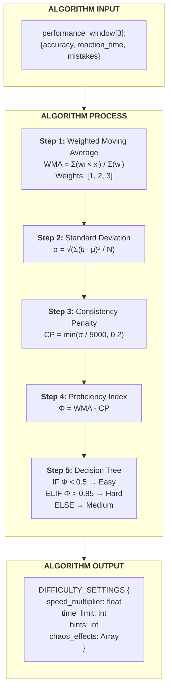

---

## 10. NETWORK ARCHITECTURE DIAGRAM

### 10.1 Multiplayer LAN Architecture

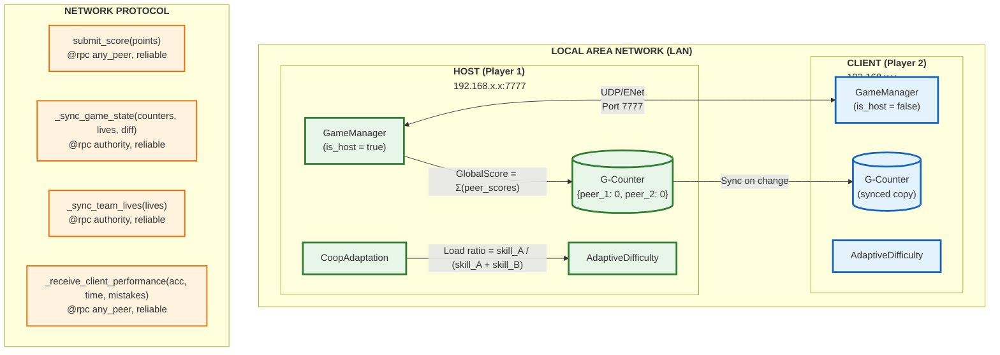

### 10.2 G-Counter CRDT Algorithm

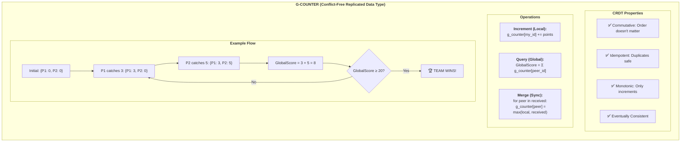

---

## APPENDIX A: FORMULAS SUMMARY

### A.1 Weighted Proficiency Index (Φ)

$$\Phi = WMA - CP$$

Where:
- **WMA (Weighted Moving Average):**
$$WMA = \frac{\sum_{i=1}^{n} w_i \cdot accuracy_i}{\sum_{i=1}^{n} w_i}$$

- **CP (Consistency Penalty):**
$$CP = \min\left(\frac{\sigma}{5000}, 0.2\right)$$

- **Standard Deviation (σ):**
$$\sigma = \sqrt{\frac{\sum_{i=1}^{n}(t_i - \mu)^2}{n}}$$

### A.2 G-Counter Global Score

$$GlobalScore = \sum_{i=1}^{n} g\_counter[peer_i]$$

### A.3 Coop Load Balancing

$$Load_{ratio} = \frac{Skill_A}{Skill_A + Skill_B}$$

$$Tasks_A = total\_tasks \times Load_{ratio}$$

---

## APPENDIX B: COLOR LEGEND

| Module/Component | Color | Hex Code |
|------------------|-------|----------|
| Presentation Module | Blue | #2196F3 |
| Business Logic Module | Green | #4CAF50 |
| Service Module | Orange | #FF9800 |
| Data Persistence Module | Purple | #9C27B0 |
| Easy Difficulty | Green | #27AE60 |
| Medium Difficulty | Yellow | #F1C40F |
| Hard Difficulty | Red | #E74C3C |
| Network/Multiplayer | Cyan | #00BCD4 |

---

## APPENDIX C: FILE STRUCTURE REFERENCE

```
waterwise/
├── autoload/
│   ├── AdaptiveDifficulty.gd    # Φ = WMA - CP algorithm
│   ├── GameManager.gd           # State controller, G-Counter, NetworkManager
│   ├── CoopAdaptation.gd        # Multiplayer skill balancing
│   └── Localization.gd          # EN/Filipino translations
├── scenes/
│   ├── minigames/               # 19 mini-games
│   │   ├── CatchTheRain.tscn
│   │   ├── BucketBrigade.tscn
│   │   ├── FixLeak.tscn
│   │   ├── ThirstyPlant.tscn
│   │   └── ... (15 more)
│   └── ui/                      # Interface screens
│       ├── InitialScreen.tscn
│       ├── MainMenu.tscn
│       ├── Settings.tscn
│       ├── CharacterCustomization.tscn
│       ├── Instructions.tscn
│       ├── MultiplayerMenu.tscn
│       ├── MultiplayerLobby.tscn
│       ├── MiniGameResults.tscn
│       └── FinalScore.tscn
├── scripts/
│   └── MiniGameBase.gd          # Abstract base class
└── project.godot                # Godot configuration
```

---

**Document End**

*Generated for WaterWise Educational Game Thesis Documentation*  
*All diagrams use Mermaid syntax for compatibility with Markdown renderers*
