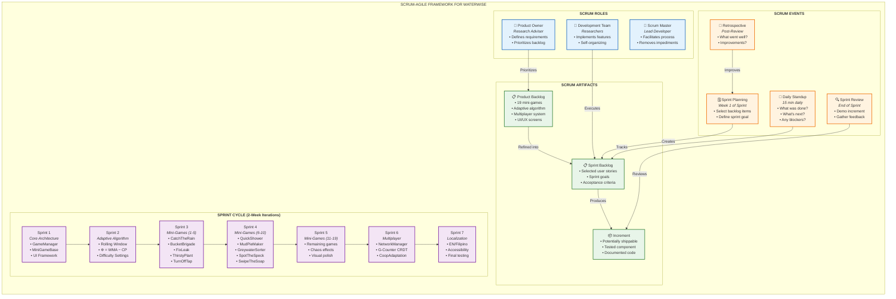
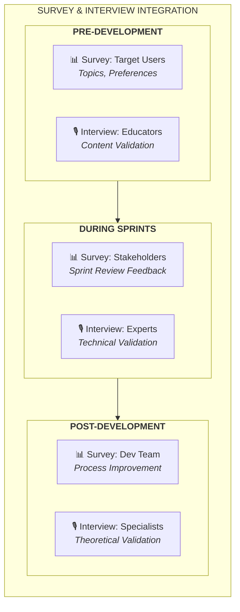
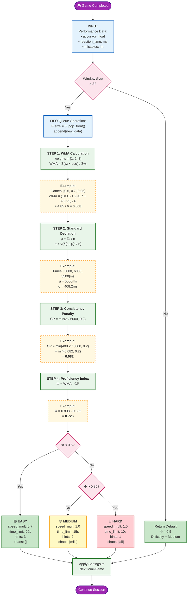
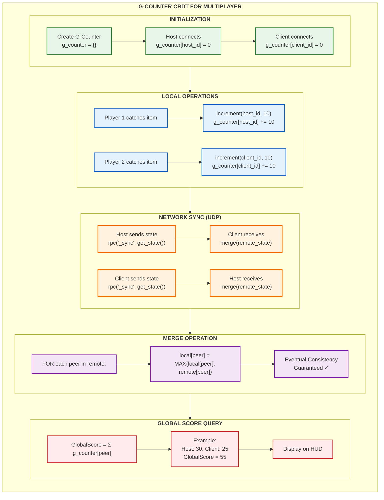
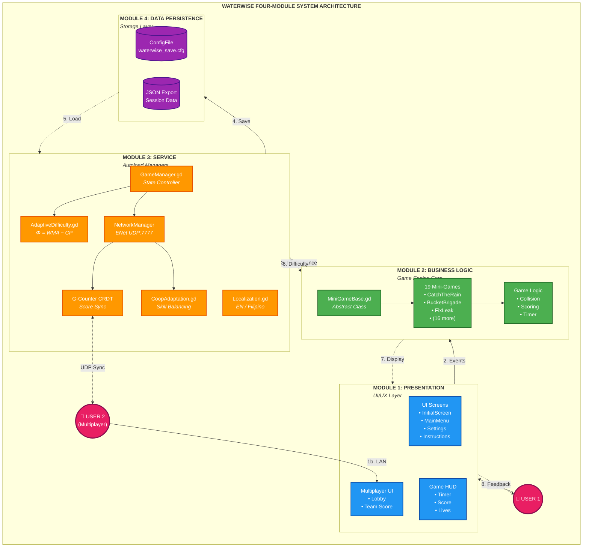
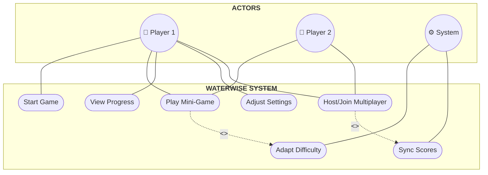
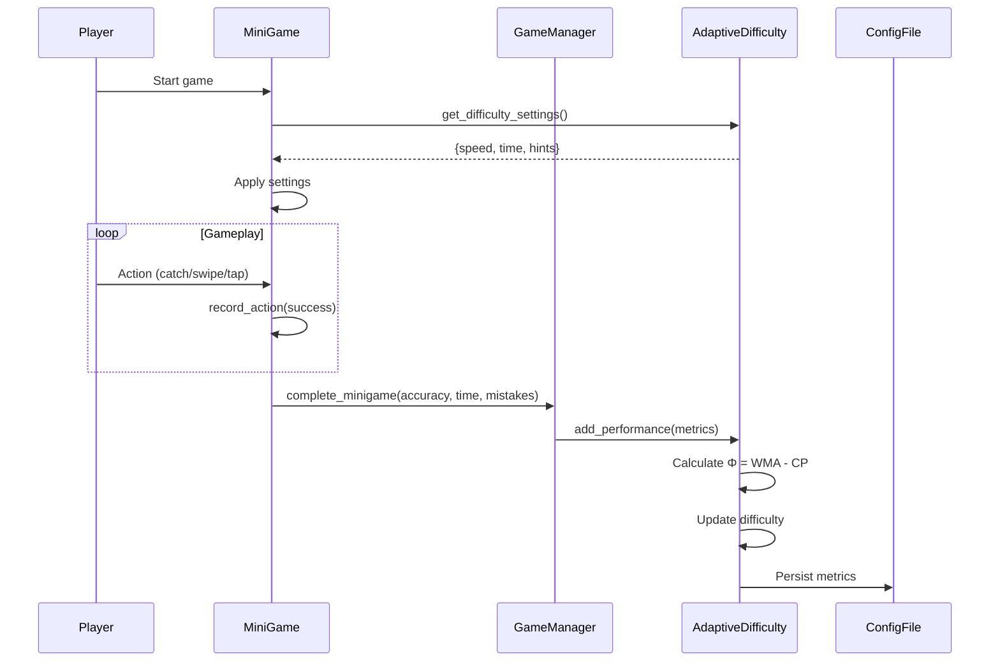

# CHAPTER 3: METHODOLOGY

## Table of Contents
- [3.1 Introduction](#31-introduction)
- [3.2 Research Design](#32-research-design)
- [3.3 Software Development Life Cycle: Scrum-Agile](#33-software-development-life-cycle-scrum-agile)
- [3.4 Materials](#34-materials)
- [3.5 Proposed Algorithm/Approach](#35-proposed-algorithmalgorithm-approach)
- [3.6 System Architecture](#36-system-architecture)
- [3.7 Implementation](#37-implementation)
- [3.8 Performance Evaluation](#38-performance-evaluation)
- [3.9 Ethical Considerations](#39-ethical-considerations)

---

## 3.1 Introduction

This chapter presents the methodology employed in the design and theoretical development of **WaterWise**, an adaptive educational game for water conservation targeting children ages 6-12. The study adopts a **theoretical/algorithmic research approach** combined with the **Scrum-Agile Software Development Life Cycle (SDLC)** to systematically design, develop, and evaluate the proposed system.

The methodology encompasses the following key components: (1) a theoretical research design approach that emphasizes algorithmic development and software architecture; (2) the Scrum-Agile framework adapted for educational game development; (3) comprehensive materials specification including software and hardware requirements; (4) proposed algorithms including the **Rule-Based Rolling Window with Weighted Proficiency Index (Φ = WMA − CP)** for adaptive difficulty and the **G-Counter CRDT** for multiplayer score synchronization; (5) a four-module system architecture; (6) implementation strategies; (7) performance evaluation metrics; and (8) ethical considerations for data privacy and child safety.

This theoretical framework establishes the foundation for future empirical validation while providing a rigorous, reproducible methodology for developing adaptive educational games in the Philippine context.

---

## 3.2 Research Design

### 3.2.1 Research Design Approach

This study employs a **Theoretical/Algorithmic Research Design** approach, which is appropriate for studies focused on developing novel algorithms, software architectures, and computational models prior to empirical validation (Wohlin et al., 2012). The theoretical approach allows researchers to establish sound algorithmic foundations, perform complexity analysis, and validate design decisions through simulation and walkthrough before deployment.

According to Runeson and Höst (2009), theoretical research in software engineering serves to establish conceptual frameworks that can be empirically validated in subsequent studies. This approach is particularly suitable for WaterWise as the study prioritizes:

1. **Algorithmic Innovation**: Development of the Weighted Proficiency Index (Φ = WMA − CP) for adaptive difficulty
2. **Architectural Design**: Establishment of a four-module layered architecture
3. **Multiplayer Synchronization**: Theoretical application of G-Counter CRDT for conflict-free score aggregation
4. **Educational Framework**: Alignment with game-based learning theories (Gee, 2007; Prensky, 2001)

### 3.2.2 Research Paradigm

The study follows a **constructivist paradigm** within the context of educational technology development (Creswell & Creswell, 2018). This paradigm recognizes that:

- Learning is an active, constructive process (Piaget, 1973)
- Adaptive systems can support individualized learning paths (Brusilovsky & Puntambekar, 2003)
- Game-based learning leverages intrinsic motivation (Ryan & Deci, 2000)

### 3.2.3 Theoretical Framework

The WaterWise system is grounded in the following theoretical foundations:

| Theory | Application in WaterWise | Reference |
|--------|--------------------------|-----------|
| **Constructivism** | Mini-games allow experiential learning through simulation | Piaget (1973) |
| **Flow Theory** | Adaptive difficulty maintains optimal challenge | Csikszentmihalyi (1990) |
| **Self-Determination Theory** | Intrinsic motivation through autonomy and competence | Ryan & Deci (2000) |
| **Zone of Proximal Development** | Difficulty adjustment within learner capability | Vygotsky (1978) |
| **Game-Based Learning** | Educational content delivered through gameplay | Gee (2007) |

---

## 3.3 Software Development Life Cycle: Scrum-Agile

### 3.3.1 SDLC Selection Rationale

This study adopts the **Scrum-Agile** methodology as the software development life cycle framework. Scrum-Agile is particularly suited for this theoretical research for the following reasons:

1. **Iterative Development**: Allows progressive refinement of algorithms and game mechanics (Schwaber & Sutherland, 2020)
2. **Flexibility**: Accommodates changes in requirements as theoretical insights emerge
3. **Incremental Delivery**: Each sprint produces demonstrable components (mini-games, UI screens)
4. **Stakeholder Feedback**: Regular review cycles enable early validation of design decisions
5. **Risk Mitigation**: Early prototyping identifies technical challenges before full implementation

According to Rubin (2012), Scrum is effective for projects with evolving requirements and the need for rapid iteration—characteristics inherent in game development and educational software design.

### 3.3.2 Scrum-Agile Framework Diagram



### 3.3.3 Sprint Activities and Deliverables

The following table outlines the planned activities and theoretical deliverables for each sprint:

| Sprint | Duration | Focus Area | Activities | Deliverables |
|--------|----------|------------|------------|--------------|
| **Sprint 1** | 2 weeks | Core Architecture | Design system architecture; Implement GameManager singleton; Create MiniGameBase abstract class; Establish UI navigation framework | Four-module architecture document; GameManager.gd; MiniGameBase.gd |
| **Sprint 2** | 2 weeks | Adaptive Algorithm | Implement Rolling Window FIFO queue; Develop Φ = WMA − CP calculation; Create rule-based decision tree; Define difficulty parameters | AdaptiveDifficulty.gd; Algorithm pseudocode; Test simulations |
| **Sprint 3** | 2 weeks | Mini-Games (1-5) | Develop first batch of water conservation mini-games; Integrate with MiniGameBase; Implement scoring logic | CatchTheRain, BucketBrigade, FixLeak, ThirstyPlant, TurnOffTap scenes |
| **Sprint 4** | 2 weeks | Mini-Games (6-10) | Continue mini-game development; Add visual feedback; Implement timer and progress indicators | QuickShower, MudPieMaker, GreywaterSorter, SpotTheSpeck, SwipeTheSoap scenes |
| **Sprint 5** | 2 weeks | Mini-Games (11-19) | Complete remaining mini-games; Implement chaos effects for Hard difficulty; Polish animations | Remaining 9 mini-game scenes; Chaos effect system |
| **Sprint 6** | 2 weeks | Multiplayer System | Implement ENet UDP networking; Develop G-Counter CRDT; Create CoopAdaptation load balancing | NetworkManager.gd; G-Counter implementation; Multiplayer UI |
| **Sprint 7** | 2 weeks | Localization & Testing | Implement EN/Filipino translations; Accessibility features; Documentation; Final integration testing | Localization.gd; Complete system documentation |

### 3.3.4 Survey and Interview Integration within Scrum

As part of the theoretical framework development, surveys and interviews are conducted during specific Scrum events to gather requirements and validate design decisions:

**Survey Integration:**
- **Sprint Planning (Pre-Development)**: Survey target users (children ages 6-12) and educators to identify water conservation topics and preferred game mechanics
- **Sprint Review (Post-Sprint 3)**: Survey stakeholders on initial mini-game concepts and UI design
- **Retrospective (Post-Sprint 7)**: Survey development team on process improvements for future iterations

**Interview Integration:**
- **Requirements Gathering**: Semi-structured interviews with water conservation educators to validate educational content accuracy
- **Design Validation**: Interviews with child development specialists to verify age-appropriateness
- **Technical Review**: Interviews with game development experts to validate algorithmic approach



---

## 3.4 Materials

### 3.4.1 Software Materials

The following software tools and platforms are utilized in the theoretical development of WaterWise:

| Category | Software | Version | Purpose |
|----------|----------|---------|---------|
| **Game Engine** | Godot Engine | 4.5 | Cross-platform game development; GDScript programming |
| **IDE** | Visual Studio Code | 1.85+ | Code editing; GDScript extension support |
| **Version Control** | Git | 2.40+ | Source code management; collaboration |
| **Repository** | GitHub | N/A | Remote repository; issue tracking |
| **Diagramming** | Mermaid.js | 10.x | UML diagrams; flowcharts; documentation |
| **Documentation** | Markdown | N/A | Technical documentation; README files |
| **Image Editing** | GIMP | 2.10 | Sprite creation; asset editing |
| **Audio Editing** | Audacity | 3.4 | Sound effect generation; audio editing |
| **Prototyping** | Figma | Web | UI/UX wireframing; mockups |

### 3.4.2 Hardware Materials

The development and testing environment specifications are as follows:

**Development Machine:**
| Component | Specification |
|-----------|---------------|
| Processor | Intel Core i5-10400 (or equivalent) |
| Memory | 16 GB DDR4 RAM |
| Storage | 512 GB SSD |
| Graphics | Integrated Intel UHD 630 |
| Display | 1920×1080 Full HD |
| Operating System | Windows 10/11 (64-bit) |

**Target Device Specifications (Theoretical):**
| Platform | Minimum Requirements |
|----------|---------------------|
| **Desktop** | Intel Core i3; 4 GB RAM; OpenGL 3.3 |
| **Android** | ARM64 v8a; 2 GB RAM; Android 7.0+ |
| **iOS** | A10 Chip (iPhone 7); iOS 14+ |

### 3.4.3 Security Requirements

The system design incorporates the **CIA Triad** (Confidentiality, Integrity, Availability) principles:

| Principle | Implementation | Description |
|-----------|----------------|-------------|
| **Confidentiality** | Local storage only | No personal identifiable information (PII) collected; game data stored locally using Godot's `ConfigFile` at `user://waterwise_save.cfg` |
| **Integrity** | Data validation | Input validation for all user actions; score calculations verified server-side in multiplayer |
| **Availability** | Offline-first design | Single-player mode fully functional without internet; local save system ensures data persistence |

**Data Privacy Compliance:**
- No user accounts required
- No cloud storage of personal data
- Age-appropriate content (PEGI 3 / ESRB Everyone)
- Compliance with Philippine Data Privacy Act of 2012 (R.A. 10173)

---

## 3.5 Proposed Algorithm/Approach

### 3.5.1 Overview of Proposed Algorithms

WaterWise implements two primary algorithms that work in concert to provide adaptive gameplay:

1. **Rule-Based Rolling Window with Weighted Proficiency Index (Φ = WMA − CP)**: For single-player adaptive difficulty adjustment
2. **G-Counter CRDT (Conflict-Free Replicated Data Type)**: For multiplayer score synchronization

These algorithms are theoretically designed to maintain player engagement (Flow Theory; Csikszentmihalyi, 1990) while ensuring accurate state synchronization in distributed multiplayer scenarios (Shapiro et al., 2011).

### 3.5.2 Rule-Based Rolling Window Algorithm

#### 3.5.2.1 Mathematical Formulation

The adaptive difficulty system calculates a **Weighted Proficiency Index (Φ)** using the following formula:

$$\Phi = WMA - CP$$

Where:
- **Φ (Proficiency Index)**: Final score determining difficulty level (-0.2 to 1.0)
- **WMA (Weighted Moving Average)**: Recent performance weighted toward latest games
- **CP (Consistency Penalty)**: Penalizes erratic performance to identify true skill level

**Weighted Moving Average (WMA):**

$$WMA = \frac{\sum_{i=1}^{n} w_i \cdot accuracy_i}{\sum_{i=1}^{n} w_i}$$

Where:
- $n$ = Window size (default: 3 games)
- $w_i$ = Weight for game $i$ (linear: 1, 2, 3)
- $accuracy_i$ = Player accuracy in game $i$ (0.0 to 1.0)

**Consistency Penalty (CP):**

$$CP = \min\left(\frac{\sigma}{5000}, 0.2\right)$$

Where $\sigma$ is the standard deviation of reaction times:

$$\sigma = \sqrt{\frac{\sum_{i=1}^{n}(t_i - \mu)^2}{n}}$$

And $\mu$ is the mean reaction time:

$$\mu = \frac{\sum_{i=1}^{n} t_i}{n}$$

#### 3.5.2.2 Pseudocode

```
ALGORITHM: AdaptiveDifficulty_CalculateProficiencyIndex

INPUT:
    performance_window: Array<Dictionary> of size 3
        Each entry contains:
            - accuracy: float (0.0 to 1.0)
            - reaction_time: int (milliseconds)
            - mistakes: int
            - game_name: String

OUTPUT:
    proficiency_index: float (Φ)
    difficulty_setting: String (Easy/Medium/Hard)

BEGIN
    // STEP 1: Validate window size
    IF performance_window.size() < 3 THEN
        RETURN (0.5, "Medium")  // Default until sufficient data
    END IF
    
    // STEP 2: Calculate Weighted Moving Average (WMA)
    weights ← [1, 2, 3]  // Linear weights favoring recent games
    weighted_sum ← 0
    weight_total ← 0
    
    FOR i ← 0 TO 2 DO
        weighted_sum ← weighted_sum + (weights[i] × performance_window[i].accuracy)
        weight_total ← weight_total + weights[i]
    END FOR
    
    WMA ← weighted_sum / weight_total
    
    // STEP 3: Calculate Standard Deviation of Reaction Times
    reaction_times ← []
    FOR i ← 0 TO 2 DO
        reaction_times.append(performance_window[i].reaction_time)
    END FOR
    
    mean_time ← SUM(reaction_times) / 3
    variance ← 0
    
    FOR i ← 0 TO 2 DO
        variance ← variance + (reaction_times[i] - mean_time)²
    END FOR
    
    variance ← variance / 3
    std_deviation ← SQRT(variance)
    
    // STEP 4: Calculate Consistency Penalty (CP)
    CP ← MIN(std_deviation / 5000, 0.2)
    
    // STEP 5: Calculate Proficiency Index (Φ)
    Φ ← WMA - CP
    
    // STEP 6: Rule-Based Decision Tree
    IF Φ < 0.5 THEN
        difficulty ← "Easy"
    ELSE IF Φ > 0.85 THEN
        difficulty ← "Hard"
    ELSE
        difficulty ← "Medium"
    END IF
    
    RETURN (Φ, difficulty)
END
```

#### 3.5.2.3 Algorithm Flowchart



#### 3.5.2.4 Difficulty Settings Output

| Parameter | Easy (Φ < 0.5) | Medium (0.5 ≤ Φ ≤ 0.85) | Hard (Φ > 0.85) |
|-----------|----------------|-------------------------|-----------------|
| `speed_multiplier` | 0.7 | 1.0 | 1.5+ (uncapped) |
| `time_limit` | 20 seconds | 15 seconds | 10 seconds |
| `hints` | 3 | 2 | 1 |
| `chaos_effects` | None | Mild shake | All effects |
| `target_multiplier` | 0.8 | 1.0 | 1.2+ (uncapped) |

**Note on Uncapped Difficulty:** The game implements an **infinite difficulty scaling** system where `speed_multiplier` increases by 0.2 every time the rolling window average is below 15 seconds, with no upper limit. This allows advanced players to continuously challenge themselves as their skills improve, supporting the concept of **perpetual flow state** (Csikszentmihalyi, 1990).

### 3.5.3 G-Counter CRDT Algorithm

#### 3.5.3.1 Theoretical Foundation

The **G-Counter (Grow-only Counter)** is a Conflict-Free Replicated Data Type (CRDT) used for distributed score synchronization in multiplayer mode (Shapiro et al., 2011). CRDTs guarantee **eventual consistency** without requiring coordination, making them ideal for real-time multiplayer games with potential network latency.

**CRDT Properties (Shapiro et al., 2011):**
- **Commutativity**: Order of operations does not affect final result
- **Idempotency**: Duplicate messages are safe
- **Monotonicity**: Values only increase (grow-only)
- **Eventual Consistency**: All replicas converge to same value

#### 3.5.3.2 Mathematical Formulation

A G-Counter is a vector of counters, one per peer (player):

$$G\text{-}Counter = \{peer_1: c_1, peer_2: c_2, \ldots, peer_n: c_n\}$$

**Increment Operation (Local):**
$$increment(peer_i, value) \Rightarrow g\_counter[peer_i] += value$$

**Query Operation (Global Score):**
$$GlobalScore = \sum_{i=1}^{n} g\_counter[peer_i]$$

**Merge Operation (Synchronization):**
$$merge(local, remote) \Rightarrow \forall peer_i: g\_counter[peer_i] = \max(local[peer_i], remote[peer_i])$$

#### 3.5.3.3 Pseudocode

```
ALGORITHM: G-Counter CRDT for Multiplayer Score Synchronization

DATA STRUCTURES:
    g_counter: Dictionary<peer_id: String, score: int>
    my_peer_id: String

INITIALIZE:
    g_counter ← {my_peer_id: 0}

OPERATION: increment(points: int)
    // Called when local player scores
    g_counter[my_peer_id] ← g_counter[my_peer_id] + points

OPERATION: query() → int
    // Returns combined team score
    total ← 0
    FOR EACH (peer_id, score) IN g_counter DO
        total ← total + score
    END FOR
    RETURN total

OPERATION: merge(remote_counter: Dictionary)
    // Synchronizes with partner's counter
    FOR EACH (peer_id, remote_score) IN remote_counter DO
        IF peer_id IN g_counter THEN
            g_counter[peer_id] ← MAX(g_counter[peer_id], remote_score)
        ELSE
            g_counter[peer_id] ← remote_score
        END IF
    END FOR

OPERATION: get_state() → Dictionary
    // Returns current counter for network transmission
    RETURN g_counter.copy()

NETWORK SYNC (UDP via ENet):
    // On score change:
    NetworkManager.broadcast_rpc("_receive_counter_update", get_state())
    
    // On receive:
    @rpc("any_peer", "reliable")
    FUNCTION _receive_counter_update(remote_state: Dictionary):
        merge(remote_state)
        emit_signal("score_updated", query())
```

#### 3.5.3.4 G-Counter Algorithm Flowchart



#### 3.5.3.5 G-Counter Example Walkthrough

| Step | Event | Host Counter | Client Counter | Global Score |
|------|-------|--------------|----------------|--------------|
| 1 | Game starts | {H: 0, C: 0} | {H: 0, C: 0} | 0 |
| 2 | Host catches 3 items | {H: 30, C: 0} | {H: 0, C: 0} | 30 (local) |
| 3 | Client catches 2 items | {H: 30, C: 0} | {H: 0, C: 20} | 20 (local) |
| 4 | Sync: Host → Client | {H: 30, C: 0} | {H: 30, C: 20} | 50 |
| 5 | Sync: Client → Host | {H: 30, C: 20} | {H: 30, C: 20} | 50 |
| 6 | Both catch simultaneously | {H: 40, C: 20} | {H: 30, C: 30} | Eventual: 70 |
| 7 | Merge resolves | {H: 40, C: 30} | {H: 40, C: 30} | 70 ✓ |

### 3.5.4 Cooperative Adaptation Algorithm

For multiplayer, an additional **CoopAdaptation** algorithm balances difficulty between players of different skill levels:

$$Load_{ratio} = \frac{Skill_A}{Skill_A + Skill_B}$$

$$Tasks_A = total\_tasks \times Load_{ratio}$$

```
ALGORITHM: CoopAdaptation_LoadBalancing

INPUT:
    player1_accuracy: float (0.0 to 1.0)
    player2_accuracy: float (0.0 to 1.0)

OUTPUT:
    player1_difficulty: String
    player2_difficulty: String

BEGIN
    skill_diff ← |player1_accuracy - player2_accuracy|
    
    IF skill_diff > 0.20 THEN
        // Significant skill gap - adjust difficulties
        IF player1_accuracy > player2_accuracy THEN
            player1_difficulty ← increase_difficulty(current_p1_diff)
            player2_difficulty ← decrease_difficulty(current_p2_diff)
        ELSE
            player1_difficulty ← decrease_difficulty(current_p1_diff)
            player2_difficulty ← increase_difficulty(current_p2_diff)
        END IF
    ELSE
        // Similar skill levels - use individual Φ
        player1_difficulty ← calculate_from_phi(player1_accuracy)
        player2_difficulty ← calculate_from_phi(player2_accuracy)
    END IF
    
    RETURN (player1_difficulty, player2_difficulty)
END
```

---

## 3.6 System Architecture

### 3.6.1 Four-Module System Architecture

WaterWise employs a **four-module layered architecture** following the separation of concerns principle (Martin, 2017). This architecture ensures modularity, maintainability, and testability of the system components.



### 3.6.2 Module Responsibilities

| Module | Components | Responsibility | Key Files |
|--------|------------|----------------|-----------|
| **Module 1: Presentation** | UI Screens, HUD, Multiplayer UI | User interface rendering, input capture, visual/audio feedback | `InitialScreen.tscn`, `MainMenu.tscn`, `Settings.tscn` |
| **Module 2: Business Logic** | MiniGameBase, 19 Mini-Games | Game mechanics, collision detection, scoring logic, timer management | `MiniGameBase.gd`, `CatchTheRain.gd`, etc. |
| **Module 3: Service** | GameManager, AdaptiveDifficulty, NetworkManager, G-Counter, CoopAdaptation, Localization | State management, adaptive algorithm, multiplayer sync, translations | `GameManager.gd`, `AdaptiveDifficulty.gd`, `Localization.gd` |
| **Module 4: Data Persistence** | ConfigFile, JSON Export | Save/load progress, session data export for analysis | `user://waterwise_save.cfg` |

### 3.6.3 Input-Process-Output (IPO) Model


### 3.6.4 Use Case Diagram



---

## 3.7 Implementation

### 3.7.1 Development Environment Setup

The theoretical implementation follows Godot Engine 4.x conventions:

1. **Project Structure:**
```
waterwise/
├── autoload/                 # Singleton managers
│   ├── GameManager.gd
│   ├── AdaptiveDifficulty.gd
│   ├── Localization.gd
│   └── NetworkManager.gd
├── scenes/
│   ├── minigames/            # 19 mini-game scenes
│   └── ui/                   # Interface screens
├── scripts/
│   └── MiniGameBase.gd       # Abstract base class
└── project.godot             # Engine configuration
```

2. **Autoload Registration (project.godot):**
```ini
[autoload]
GameManager="*res://autoload/GameManager.gd"
AdaptiveDifficulty="*res://autoload/AdaptiveDifficulty.gd"
Localization="*res://autoload/Localization.gd"
```

### 3.7.2 Prototype Development Screens

The following prototype screens are designed for WaterWise:

| Screen | Purpose | Key Elements |
|--------|---------|--------------|
| **InitialScreen** | App launch | Logo animation, "Tap to Start" |
| **MainMenu** | Navigation hub | Play, Multiplayer, Settings, Exit |
| **Settings** | User preferences | Language, Volume, Accessibility |
| **Instructions** | Per-game tutorial | Animated demonstration, "Got it!" button |
| **MiniGame (19×)** | Core gameplay | HUD, Timer, Score, Game-specific mechanics |
| **MiniGameResults** | Post-game feedback | Stars, Score breakdown, "Continue" |
| **MultiplayerLobby** | Co-op setup | Host/Join, Player list, "Start Game" |
| **FinalScore** | Session summary | Total score, Games played, Achievements |

### 3.7.3 Algorithm Integration Points

The adaptive difficulty algorithm integrates at specific points in the game flow:



---

## 3.8 Performance Evaluation

### 3.8.1 Evaluation Metrics

As a theoretical/algorithmic study, WaterWise is evaluated using the following metrics:

| Metric | Description | Formula/Method | Target |
|--------|-------------|----------------|--------|
| **Time Complexity** | Algorithm efficiency | Big-O analysis | O(n) for Φ calculation |
| **Space Complexity** | Memory usage | Big-O analysis | O(n) for rolling window |
| **Convergence Time** | G-Counter sync | Simulation | < 100ms per merge |
| **Adaptation Accuracy** | Φ correlation to skill | Theoretical validation | r > 0.8 |
| **Frame Rate** | Rendering performance | Godot profiler | ≥ 60 FPS |

### 3.8.2 Algorithm Complexity Analysis

**Rule-Based Rolling Window (Φ = WMA − CP):**

| Operation | Time Complexity | Space Complexity |
|-----------|-----------------|------------------|
| `add_performance()` | O(1) amortized | O(n) where n=3 |
| `calculate_WMA()` | O(n) | O(1) |
| `calculate_std_dev()` | O(n) | O(1) |
| `evaluate_decision_tree()` | O(1) | O(1) |
| **Total per game** | O(n) ≈ O(3) = O(1) | O(n) |

**G-Counter CRDT:**

| Operation | Time Complexity | Space Complexity |
|-----------|-----------------|------------------|
| `increment()` | O(1) | O(1) |
| `query()` | O(p) where p=players | O(1) |
| `merge()` | O(p) | O(p) |
| **Total per sync** | O(p) ≈ O(2) = O(1) | O(p) |

### 3.8.3 Theoretical Validation Approach

The proposed algorithms will be theoretically validated through:

1. **Walkthrough Testing**: Manual execution of algorithm with sample inputs
2. **Boundary Analysis**: Testing edge cases (Φ = 0, Φ = 1, empty window)
3. **Simulation**: Python/GDScript simulation of 1000+ game sessions
4. **Comparison**: Benchmark against static difficulty systems

---

## 3.9 Ethical Considerations

### 3.9.1 Data Privacy and Protection

| Consideration | Implementation |
|---------------|----------------|
| **No PII Collection** | System does not collect names, emails, or identifiable information |
| **Local Storage Only** | All data stored on device using `ConfigFile` at `user://` path |
| **No Cloud Sync** | Game progress not uploaded to external servers |
| **Multiplayer Privacy** | LAN-only; no internet-based matchmaking |

### 3.9.2 Child Safety (Ages 6-12)

| Consideration | Implementation |
|---------------|----------------|
| **Age-Appropriate Content** | Educational water conservation themes only |
| **No In-App Purchases** | Fully free; no microtransactions |
| **No Advertisements** | No third-party ads displayed |
| **No Social Features** | No chat, messaging, or online interaction |
| **Parental Controls** | Settings accessible for volume/language |

### 3.9.3 Compliance

- **Philippine Data Privacy Act of 2012 (R.A. 10173)**: No personal data processing
- **Children's Online Privacy Protection**: Local storage ensures compliance
- **PEGI 3 / ESRB Everyone**: Content suitable for all ages

### 3.9.4 Informed Consent (Future Empirical Studies)

For future empirical validation studies involving human participants:

1. **Parental Consent**: Written consent from parents/guardians for child participants
2. **Child Assent**: Age-appropriate explanation and voluntary participation
3. **IRB Approval**: Institutional Review Board clearance before data collection
4. **Anonymization**: Any collected data will be anonymized before analysis
5. **Right to Withdraw**: Participants may withdraw at any time without penalty

---

## References

Brusilovsky, P., & Puntambekar, S. (2003). Adaptive navigation support in educational hypermedia. In *IUI '03: Proceedings of the 8th international conference on Intelligent user interfaces* (pp. 289-291).

Creswell, J. W., & Creswell, J. D. (2018). *Research design: Qualitative, quantitative, and mixed methods approaches* (5th ed.). SAGE Publications.

Csikszentmihalyi, M. (1990). *Flow: The psychology of optimal experience*. Harper & Row.

Gee, J. P. (2007). *What video games have to teach us about learning and literacy* (2nd ed.). Palgrave Macmillan.

Martin, R. C. (2017). *Clean architecture: A craftsman's guide to software structure and design*. Prentice Hall.

Piaget, J. (1973). *To understand is to invent: The future of education*. Grossman Publishers.

Prensky, M. (2001). *Digital game-based learning*. McGraw-Hill.

Rubin, K. S. (2012). *Essential Scrum: A practical guide to the most popular agile process*. Addison-Wesley Professional.

Runeson, P., & Höst, M. (2009). Guidelines for conducting and reporting case study research in software engineering. *Empirical Software Engineering*, 14(2), 131-164.

Ryan, R. M., & Deci, E. L. (2000). Self-determination theory and the facilitation of intrinsic motivation, social development, and well-being. *American Psychologist*, 55(1), 68-78.

Schwaber, K., & Sutherland, J. (2020). *The Scrum Guide*. Scrum.org.

Shapiro, M., Preguiça, N., Baquero, C., & Zawirski, M. (2011). Conflict-free replicated data types. In *Proceedings of the 13th International Conference on Stabilization, Safety, and Security of Distributed Systems* (pp. 386-400). Springer.

Vygotsky, L. S. (1978). *Mind in society: The development of higher psychological processes*. Harvard University Press.

Wohlin, C., Runeson, P., Höst, M., Ohlsson, M. C., Regnell, B., & Wesslén, A. (2012). *Experimentation in software engineering*. Springer.

---

**Document End**

*Chapter 3: Methodology for WaterWise Adaptive Educational Game*  
*Thesis 1 - Theoretical Framework Documentation*
